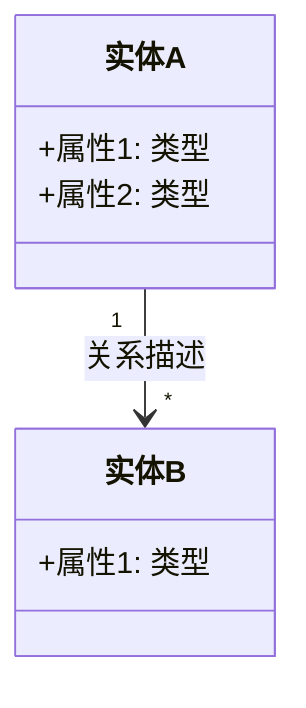
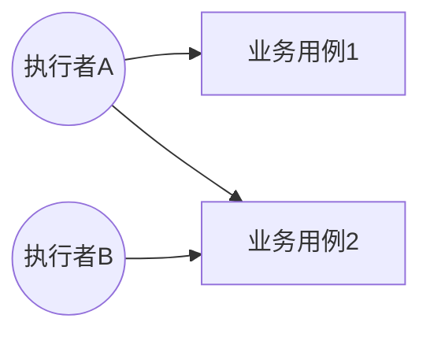
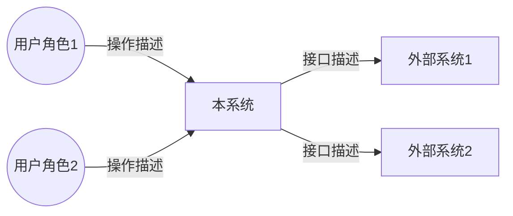
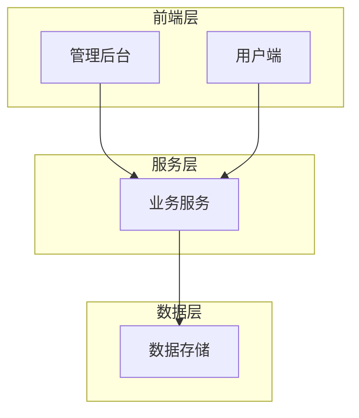
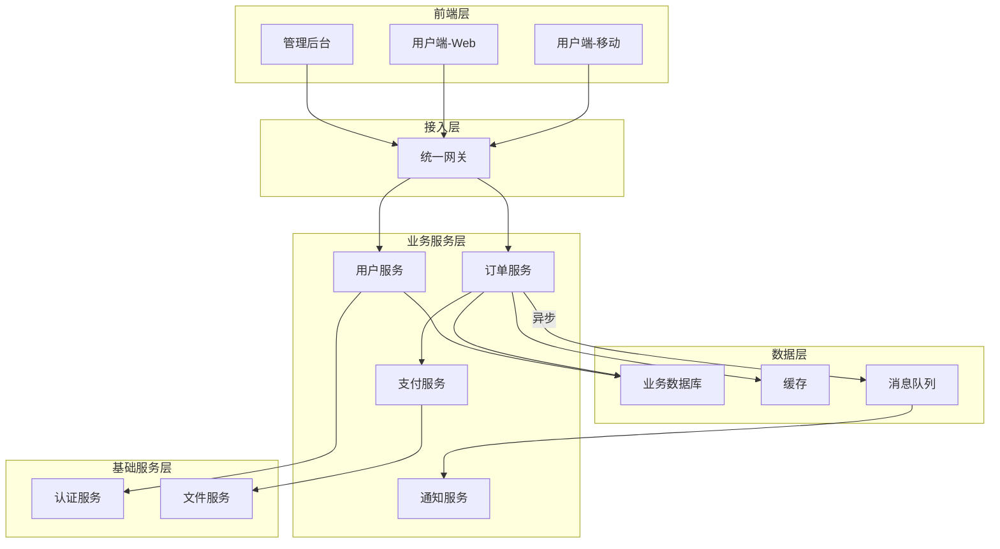
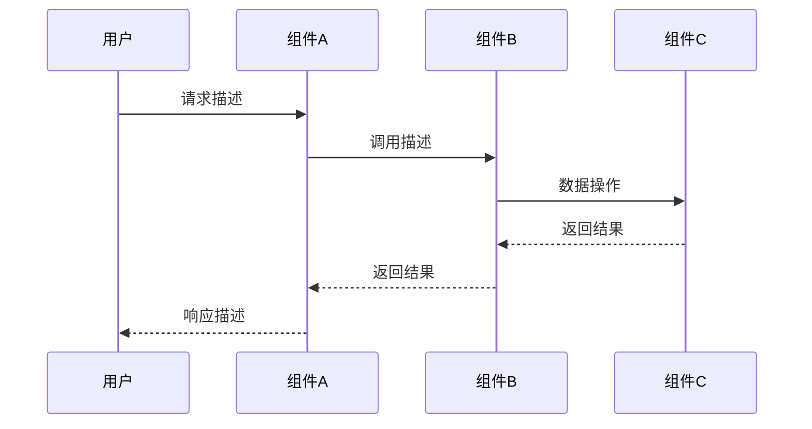
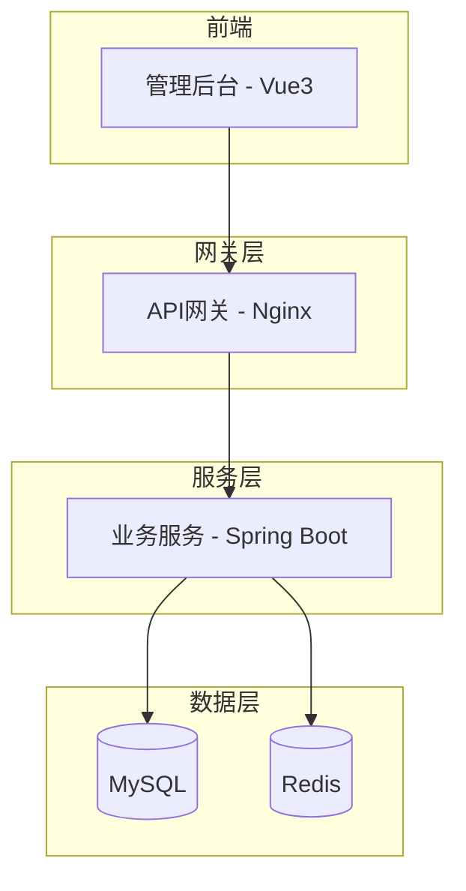
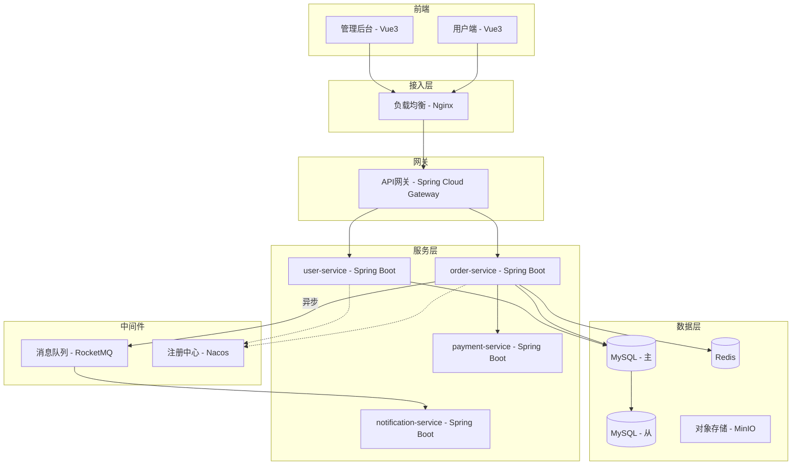

# 架构设计文档模板（AI友好版）

> 基于科大讯飞架构设计模板优化，面向AI辅助生成场景。
> 所有流程图、架构图使用 Mermaid 格式，便于AI直接生成和版本管理。

---

## 全局规则

### 输出格式规范

| 内容类型 | 格式要求 |
|----------|----------|
| 列举型内容（角色、组件、指标等） | 必须使用**表格** |
| 流程/架构/关系型内容 | 必须使用 **Mermaid 图 + 文字说明** |
| 描述型内容（策略、方案等） | 必须使用**分点列表**，禁止大段纯文字 |
| 决策型内容 | 必须使用 **ADR 格式** |

### 信息提取三级策略

统一按以下优先级处理：

| 级别 | 条件 | 处理方式 |
|------|------|----------|
| ① 直接提取 | 需求文档中有明确描述 | 直接引用，来源标注"需求文档" |
| ② AI推导 | 需求文档中无直接描述，但可从上下文推导 | AI推导并标注"AI基于需求推导"，**用斜体标识** |
| ③ 待补充 | 完全无依据，无法推导 | 标注"待补充"，在用户交互环节集中询问 |

### 术语一致性约束

生成每个章节后须自查：所有业务术语必须与第7节术语表一致。若发现新术语，须同步更新术语表。

### 生成模式选择

在文档生成开始前，询问用户选择生成模式：

| 模式 | 说明 | 适用场景 |
|------|------|----------|
| **逐步确认模式**（默认） | 分5个阶段输出，每阶段暂停等待用户确认 | 重要项目、首次使用、需求不明确 |
| **一次性生成模式** | AI一次输出全部内容，最后统一确认 | 简单项目、需求清晰、用户时间有限 |

> 若用户未明确选择，默认使用逐步确认模式。

### 文档产物命名规则

> 遵循 lyspec-orchestrator 定义的统一命名规范：`{projectName}_{projectVersion}_{文档类型}_{日期}.{ext}`

完成架构设计后，输出文档文件。命名规则：
- 若用户指定了文档名称，使用用户指定的名称
- 若用户未指定，按 **{projectName}_{projectVersion}_ARCH_{YYYY-MM-DD}** 格式命名
- 存放到 `doc/` 目录

### 输出格式选择

| 格式 | 文件名 | 说明 |
|------|--------|------|
| Markdown（默认） | `doc/{projectName}_{projectVersion}_ARCH_{日期}.md` | 版本管理、AI可读 |
| Word（可选） | `doc/{projectName}_{projectVersion}_ARCH_{日期}.docx` | 项目交付、评审签字 |

> AI须在文档完成后主动询问："是否需要同时输出 Word 格式？"
> Word 格式通过 `docx` skill 从 Markdown 转换生成。

---

## 前置条件：需求文档输入

> **本文档的所有内容均以需求文档为核心输入。**

**AI执行流程**：

0. **判断是否需要架构设计**：
   - **新系统/大版本升级**（首次开发、技术栈变更、系统重构、新增子系统）→ 架构设计**必需**，继续执行
   - **小功能迭代**（在已有系统上新增功能、修改业务逻辑）→ **主动询问用户**："当前为小功能迭代，是否需要架构设计？通常小迭代沿用已有架构，可跳过此环节"
   - 若用户确认不需要 → 跳过本skill，记录"架构设计：沿用已有架构"
   - 若用户确认需要 → 继续执行下方流程

1. **确认需求文档**：若用户已指定需求文档，直接使用；若未指定，**询问用户**："请提供需求文档路径或内容，架构设计将以此为依据"
2. **深度阅读需求文档**：逐章逐节阅读需求文档全部内容，提取以下关键信息：
   - 业务背景、愿景目标
   - 功能需求清单和业务流程
   - 非功能性需求（性能、用户规模、效果等）
   - 角色与权限定义
   - 外部系统对接需求
   - 技术约束和限制条件
3. **基于需求文档驱动架构设计**：后续每个章节的内容均从需求文档中提取或推导，不可脱离需求文档凭空设计

### 分步输出策略（逐步确认模式）

文档分5个阶段输出，每阶段完成后**暂停等待用户确认**再继续：

| 阶段 | 输出内容 | 暂停点 |
|------|----------|--------|
| 阶段一 | 项目基本信息 + 业务分析（第1~5节） | 确认业务理解是否准确 |
| 阶段二 | 需求分析（第6~10节） | 确认需求提取是否完整 |
| 阶段三 | 技术风险 + 逻辑架构（第11~14节） | **核心交互点**：确认技术风险 + 模块划分是否合理 |
| 阶段四 | 物理架构 + 非功能设计（第15~16节） | 确认非功能设计是否需要调整 |
| 阶段五 | 组件与技术清单（第17~19节） | 确认清单完整性 |

### 用户交互路线图

以下节点**必须暂停等待用户确认**，不可跳过：

```
前置 ──→ [询问] 确认需求文档
  │
阶段一 ──→ [暂停] 确认业务理解
  │
阶段二 ──→ [暂停] 确认需求提取
  │
阶段三 ──→ [暂停] ★ 确认技术风险 + 模块/微服务划分
  │
阶段四 ──→ [暂停] 确认非功能设计
  │
阶段五 ──→ [暂停] 确认清单完整性
  │
完成 ──→ 质量检查 ──→ 输出文档
```

---

## 第一部分：项目基本信息与业务分析

> **输出阶段**：阶段一

### 1. 项目基本信息

| 字段 | 内容 |
|------|------|
| 项目名称 | {从需求文档提取} |
| 文档密级 | 公司内部A |
| 文档版本 | {V1.0，后续迭代递增} |
| 编制日期 | {YYYY-MM-DD} |
| 作者 | {当前用户} |
| 需求文档来源 | {需求文档名称及版本} |

> **AI生成规则**：
> - 项目名称从需求文档中提取
> - 密级默认"公司内部A"，用户可覆盖
> - 文档版本初始为V1.0，用户可指定
> - 日期取当前日期
> - 作者默认使用当前系统用户名，无需询问
> - 需求文档来源：记录所依据的需求文档名称和版本，便于溯源

---

### 2. 愿景

> **输入依赖**：需求文档

**业务愿景**：{从需求文档提取，描述企业从事该业务的长期目标。若需求文档中无相关信息则留空}

**系统愿景**：{从需求文档提取，描述建设本系统对业务带来的改进目标。若需求文档中无相关信息则留空}

> **AI生成规则**：
> - 优先从用户提供的需求文档（PRD等）中提取愿景信息
> - 若需求文档中无明确愿景描述，对应字段留空即可，不强制填写
> - 不可凭空编造愿景内容

---

### 3. 领域模型

> **输入依赖**：需求文档中的业务描述、功能需求

对核心业务概念及其关系进行文字说明，并使用 Mermaid 类图描述。

**从需求文档推导领域模型的规则**：
- **识别实体**：需求文档中反复出现的业务名词 → 候选实体（如"订单""用户""设备"）
- **识别属性**：修饰性名词或实体的描述性字段 → 候选属性（如"订单金额""设备状态"）
- **识别关系**：动词短语或实体间的业务规则 → 候选关系（如"用户 创建 订单""设备 属于 车间"）
- **过滤噪声**：仅出现1-2次的名词、UI相关术语（按钮/页面）、技术术语不作为实体

**文字说明**：

{对领域模型中的核心实体、实体间关系进行文字描述}

**领域模型图**：



> **AI生成规则**：
> - 按上述推导规则从需求文档中提取核心业务实体
> - 使用 Mermaid classDiagram 语法
> - 实体命名使用中文
> - 先给出文字说明，再给出图
> - 实体数量建议控制在5~15个，过多时按子域拆分多张图
>
> **常见错误**：
> - ❌ 实体超过15个仍放在一张图中 → 应按子域拆分
> - ❌ 将UI元素（"登录页面""提交按钮"）识别为实体 → 应过滤
> - ❌ 将技术概念（"数据库""缓存"）混入领域模型 → 领域模型只关注业务概念

---

### 4. 业务对象

业务对象分三类：

| 类型 | 定义 | 本系统涉及的对象 |
|------|------|------------------|
| 业务执行者 | 组织以外使用组织提供的业务服务的人 | {列举} |
| 业务工人 | 支撑业务运转的组织内部人员 | {列举} |
| 业务实体 | 参与业务流程的信息系统 | {列举} |

> 业务可能需要多个组织协作完成，须将所有相关组织的业务对象一并列出。

---

### 5. 业务用例

从组织视角描述系统涉及的核心业务用例。业务用例是组织长期从事的业务的高度概括，数量通常为个位数。

**文字说明**：

{对各业务用例进行简要描述}

**业务用例图**：



> **AI生成规则**：
> - 业务用例的考察对象为**组织**，而非系统
> - 使用 Mermaid graph 语法描述用例关系
> - 用例数量通常为个位数
> - 必要时在图下方补充文字说明
>
> **常见错误**：
> - ❌ 将系统功能当作业务用例（如"用户登录""数据导出"） → 业务用例是组织层面的业务活动（如"订单履约""客户服务"）
> - ❌ 用例数量超过10个 → 粒度过细，需要合并归纳

---

## 第二部分：需求分析

> **输入依赖**：需求文档、第一部分业务分析结果
> **输出阶段**：阶段二

### 6. 利益相关者分析

| 利益相关者 | 描述 | 要求 | 优先级 |
|------------|------|------|--------|
| {角色1} | {角色描述} | {核心要求} | 高/中/低 |
| {角色2} | {角色描述} | {核心要求} | 高/中/低 |

> **AI生成规则**：从需求文档中提取利益相关者及其核心要求

---

### 7. 系统术语表

| 术语名称 | 描述 |
|----------|------|
| {术语1} | {解释} |
| {术语2} | {解释} |

> **AI生成规则**：
> - 从需求文档中提取领域术语
> - 后续所有章节中使用的业务术语必须与本表一致
> - 若后续章节中出现新术语，须回填到本表中
> - 生成每个章节后自查术语一致性

---

### 8. 系统上下文

> **输入依赖**：第4节业务对象、第6节利益相关者

**8.1 系统上下文图**



> 待开发系统作为黑箱放在中间，左边画用户角色，右边画对接的外部系统。

**8.2 参与者列表**

| 参与者/系统 | 描述 |
|-------------|------|
| {参与者1} | {说明} |
| {外部系统1} | {说明} |

**8.3 位置列表**

| 参与者/系统 | 位置 | 描述 |
|-------------|------|------|
| {本系统} | {部署位置} | {说明} |
| {用户角色1} | {使用位置} | {说明} |

---

### 9. 功能性需求（系统用例一览）

> **输入依赖**：第5节业务用例、第8节系统上下文

从业务用例推导出系统用例。系统用例分三类：用户发起、系统自主发起、外部系统发起。

| 角色 | 用例 | 时机 | 范围 | 描述 | 优先级 |
|------|------|------|------|------|--------|
| {角色} | {用例名} | {触发时机} | 产品/定制版 | {简要描述} | 高/中/低 |

> **AI生成规则**：
> - 用例从业务用例推导，按角色分组
> - 包含/继承关系通过缩进表达
> - 描述要简要，不超过一句话

---

### 10. 非功能性需求

> **优先从需求文档中提取**，需求文档中未明确的指标参考行业通用基准值补充。

#### 10.1 用户规模

| 指标 | 要求 | 来源 |
|------|------|------|
| 系统总用户数 | {数量，决定数据量} | 需求文档/用户补充 |
| 同时在线用户数 | {数量，决定访问压力} | 需求文档/用户补充 |
| 系统并发要求 | {并发数} | 需求文档/用户补充 |

#### 10.2 性能要求

| 指标 | 要求 | 来源 |
|------|------|------|
| 响应时间平均值 | ≤ {X} ms | 需求文档/行业基准 |
| 响应时间最大值 | ≤ {X} ms | 需求文档/行业基准 |
| 请求错误率 | ≤ {X}% | 需求文档/行业基准 |
| 资源使用率上限 | CPU/内存/磁盘/网卡各 ≤ 80% | 行业基准 |
| 峰值压力无故障运行 | ≥ {X} 小时 | 需求文档/行业基准 |

#### 10.3 效果要求（适用于含AI能力的系统）

| AI能力 | 效果指标 | 要求 | 来源 |
|--------|----------|------|------|
| {如：语音识别} | 准确率 | ≥ {X}% | 需求文档 |
| {如：OCR} | 准确率 | ≥ {X}% | 需求文档 |

> **AI生成规则**：
> - 优先从需求文档中提取非功能性需求的具体数值
> - 需求文档中未提及的指标，参考行业通用基准值填入，并在"来源"列标注"行业基准"
> - 用户规模和性能要求必须有具体数值，不接受空泛描述
> - 效果要求仅在系统含AI能力时填写，否则标注"不适用"

---

## 第三部分：逻辑架构

> **输入依赖**：第9节功能性需求、第10节非功能性需求、第3节领域模型
> **输出阶段**：阶段三（★ 核心交互阶段）

### 11. 技术风险识别

> **输入依赖**：需求文档、第10节非功能性需求

| 风险类型 | 风险描述 | 解决方案 |
|----------|----------|----------|
| {类型} | {描述} | {方案} |

> **AI生成规则**：
> - AI首先从需求文档中识别潜在技术风险（技术不成熟、第三方依赖、性能瓶颈等）
> - 将识别结果与模块划分方案一起在阶段三暂停点提交用户确认
> - 不可跳过此环节

---

### 12. 模块/微服务划分

> **本节是架构设计的核心环节，需要与用户交互确认。**

**AI执行流程**：
1. **基于需求文档分析**：从功能性需求（系统用例）出发，识别系统的核心业务域，进行模块/微服务划分
2. **输出划分方案**：给出模块/微服务的划分建议，包含每个模块的职责边界
3. **询问用户确认**：**必须询问用户**："以上模块划分是否合理？是否需要合并、拆分或调整某些模块？同时请确认第11节识别的技术风险是否完整。"
4. **记录调整决策**：用户的调整意见记录为架构决策记录（ADR），体现决策过程

**模块划分参考维度**：

| 维度 | 说明 | 适用场景 |
|------|------|----------|
| 按业务域划分 | 每个核心业务域对应一个模块（如：用户域、订单域、支付域） | 业务边界清晰的系统 |
| 按数据归属划分 | 拥有独立数据实体的功能聚合为一个模块 | 数据隔离要求高的系统 |
| 按变更频率划分 | 变更频率相近的功能聚合，避免高频变更影响稳定功能 | 迭代速度差异大的系统 |
| 按团队边界划分 | 一个团队负责一个模块，减少跨团队协调 | 多团队协作的项目 |

**单体 vs 微服务决策条件**：

| 条件 | 建议单体 | 建议微服务 |
|------|----------|------------|
| 团队规模 | ≤ 5人 | > 10人或多团队 |
| 业务域数量 | ≤ 3个 | > 5个且边界清晰 |
| 独立部署需求 | 统一部署即可 | 各模块需独立发布 |
| 性能隔离需求 | 无 | 某些模块有特殊性能要求 |
| 技术栈差异 | 统一技术栈 | 不同模块需不同技术栈 |

> 介于两者之间时，建议先单体后拆分（单体优先原则）。

**架构描述**：

{基于需求文档分析，说明系统的模块/微服务划分思路，解释各子系统/组件的定位和协作关系}

**架构概览图**：

简单系统示例（≤5个服务）：



中等复杂系统示例（5~15个服务）：



> **AI生成规则**：
> - 组件命名**全部使用中文**，不出现技术性元素（不写 Redis、Nginx 等）
> - 使用 Mermaid graph 语法，用 subgraph 表示层次/边界
> - 根据系统实际复杂度选择合适的图复杂度，不要一律使用最简模板
> - 图中出现的是子系统或组件，不是功能模块
>
> **常见错误**：
> - ❌ 逻辑架构图中出现具体技术名称（如"Redis缓存""Nginx网关"） → 应使用业务语义命名（如"缓存服务""统一网关"）
> - ❌ 将所有功能平铺为微服务 → 应先按业务域聚合，遵循单体优先原则
> - ❌ 组件间全部使用同步调用 → 应识别异步场景（通知、日志等）

**子系统/组件定义表**：

| 名称 | 类型 | 职责 | 依赖关系 | 通信方式 | 描述 |
|------|------|------|----------|----------|------|
| {组件名} | 服务/应用/类库 | {核心职责} | {依赖哪些组件} | HTTP/RPC/MQ | {详细描述} |

---

### 13. 系统流程

> **输入依赖**：第5节业务用例、第12节组件定义表

针对核心业务流程，给出组件级别的交互序列图。

**流程组织方式**（三选一或组合）：
- 与业务流程 1:1 对应
- 对业务流程分解，提取系统涉及的部分
- 基于逻辑架构进行技术性归纳（通用技术流程）

**流程：{流程名称}**



> **AI生成规则**：
> - 使用 Mermaid sequenceDiagram 语法，participant 使用中文名
> - 核心业务流程选取 **3~5个**，覆盖系统主要用例即可，不必穷举所有流程
> - 优先选择：涉及多组件协作的流程、包含异步/消息的流程、核心业务主路径

---

### 14. 架构决策记录（ADR）

> 记录架构设计全过程中的关键决策，包括模块划分调整、技术选型权衡等。

**AI执行流程**：
- 模块划分阶段用户提出的调整意见 → 记录为 ADR
- 技术选型中的权衡 → 记录为 ADR
- 每条 ADR 至少列出2个以上可选方案

#### ADR-{编号}：{决策标题}

**状态**：已决定 / 待讨论 / 已废弃

**背景（Context）**：
{描述面临的问题和约束条件}

**决策点（Decision Drivers）**：
- {驱动因素1}
- {驱动因素2}

**可选方案**：

| 方案 | 描述 | 优点 | 缺点 |
|------|------|------|------|
| 方案1 | {描述} | {优点} | {缺点} |
| 方案2 | {描述} | {优点} | {缺点} |
| 方案3 | {描述} | {优点} | {缺点} |

**决策（Decision）**：选择方案{N}

**理由（Rationale）**：
{解释为什么选择该方案}

**影响（Consequences）**：
- 正面：{积极影响}
- 负面：{需要承担的代价或风险}

---

## 第四部分：物理架构与非功能设计

> **输入依赖**：第12节逻辑架构、第10节非功能性需求
> **输出阶段**：阶段四

### 15. 物理架构概览

> **输入依赖**：第12节组件定义表

**架构描述**：

{将逻辑架构中的组件进行技术化：定义组件形态、英文名、通信协议。物理组件与逻辑组件不一定一对一，可能合并或增减。}

**逻辑→物理映射表**：

| 逻辑组件名（中文） | 物理组件名（英文） | 技术栈 | 变更说明 |
|--------------------|--------------------|--------|----------|
| {如：用户服务} | {如：user-service} | Spring Boot | 1:1 映射 |
| {如：订单服务} | {如：order-service} | Spring Boot | 1:1 映射 |
| {如：数据存储} | {如：mysql-primary} | MySQL 8.4 | 逻辑层"数据存储"拆分为 MySQL + Redis |
| {如：数据存储} | {如：redis-cache} | Redis 7.0 | 同上 |

> **AI生成规则**：
> - 逻辑组件与物理组件的映射关系必须在此表中显式列出
> - 变更说明标注：1:1映射 / 合并（哪些合并）/ 拆分（拆分为哪些）/ 新增（逻辑架构中没有的基础设施组件）
> - 技术选型须参考 `ai-doc/lytech-stack` 中定义的技术栈范围

**物理架构图**：

简单系统示例：



中等复杂系统示例：



> **AI生成规则**：
> - 在逻辑架构基础上标注具体技术选型
> - 技术选型须参考 `ai-doc/lytech-stack` 中定义的技术栈范围
> - 物理架构图中出现的所有技术必须在第19节技术选型清单中有对应条目
> - 根据系统实际复杂度选择合适的图复杂度

---

### 16. 非功能特性设计

> **输入依赖**：第10节非功能性需求、第15节物理架构
> **本节内容优先从需求文档中提取，然后与用户确认是否需要调整和补充。**

**AI执行流程**：
1. **扫描需求文档**：识别需求文档中涉及了哪些非功能维度
2. **按需生成**：仅对需求文档中提及的维度或系统必然涉及的维度（如安全性）输出详细设计
3. **未涉及维度汇总**：将需求文档未提及的维度汇总到"未涉及维度"表中
4. **标注信息来源**：每项设计标注是"需求文档"还是"AI基于架构分析补充"
5. **输出后询问用户**：**必须询问用户**："以上非功能特性设计已基于需求文档提取并补充，请确认：
   - 已列出的设计是否需要调整？
   - '未涉及维度'中是否有需要补充的？"
6. **记录调整**：用户的调整意见如涉及架构权衡，记录到第14节 ADR 中

**复杂度自适应规则**：

| 系统复杂度 | 建议输出的维度数量 | 必须包含的维度 |
|------------|-------------------|---------------|
| 简单系统（≤3个服务） | 3~5个维度 | 安全性、性能、可部署性 |
| 中等系统（3~10个服务） | 5~8个维度 | 安全性、性能、可用性、可伸缩性、可部署性 |
| 复杂系统（>10个服务） | 按需全面覆盖 | 根据系统特点选择 |

> 不要为简单系统强行输出所有13个维度，避免内容空洞。

**以下子节按需输出，仅在需求文档涉及或系统必然需要时生成详细内容。**

#### 16.1 可用性设计

{描述各组件的高可用策略}
- 冗余策略（主从/多实例/多活）
- 负载均衡方案
- 备份恢复策略
- 故障切换机制

#### 16.2 性能设计

**应用层设计**：
- 缓存策略（缓存什么、缓存层级、失效机制）
- 异步处理（哪些场景使用消息队列）
- 并行计算（哪些计算可并行）
- 连接池配置

**业务策略设计**：
- 限流策略（哪些接口、阈值多少）
- 错峰调度（批量任务的执行时间）
- 降级策略（核心功能保障）

#### 16.3 安全性设计

**威胁建模**：

| 需要保护的资产 | 描述 | 价值 | 威胁 | 威胁来源 | 威胁方式 | 风险等级 | 应对策略 |
|----------------|------|------|------|----------|----------|----------|----------|
| {资产} | {描述} | 高/中/低 | {威胁} | {来源} | {方式} | 高/中/低 | {策略} |

> **AI生成规则**：根据需求文档中的数据资产和系统特点，自动识别核心资产和潜在威胁

**网络层安全策略**：
- 安全区域划分
- 网络隔离策略
- 防火墙规则

**应用层安全策略**：

用户角色及认证方式（从需求文档中角色定义提取）：

| 角色 | 描述 | 发展方式 | 认证方式 |
|------|------|----------|----------|
| {角色} | {描述} | {内置/注册/添加} | {认证方式} |

访问控制（从需求文档中权限要求提取）：

| 角色 | 功能权限 | 数据权限 |
|------|----------|----------|
| {角色} | {权限描述} | {数据范围} |

接口安全：
- 对外API认证机制
- 接口限流策略
- 数据传输加密

审计：
- 操作日志覆盖范围
- 日志留存策略
- 日志防护机制

#### 16.4 可伸缩性设计

- 水平扩展策略（哪些层可水平扩展）
- 垂直扩展策略（硬件升级路径）
- 容量伸缩（存储扩展方案）

#### 16.5 可扩展性设计

- 需要支持扩展的方面（对接新平台、新业务等）
- 扩展机制（插件化/配置化/SPI）

#### 16.6 可移植性设计

- 操作系统移植策略
- 数据库移植策略
- 硬件替换策略（如国产化）

#### 16.7 容错性设计

- 网络中断场景处理
- 服务故障降级策略
- 数据一致性保障

#### 16.8 可部署性设计

- 部署方式（手工/自动化/容器化）
- 升级策略（滚动/蓝绿/金丝雀）
- 回滚机制

#### 16.9 可监控性设计

- 基础设施监控
- 应用性能监控（APM）
- 业务指标监控
- 告警策略

#### 16.10 兼容性设计

- 浏览器兼容范围
- 移动设备兼容范围
- 中间件版本兼容

#### 16.11 经济性设计

- 硬件成本控制策略
- 研发成本控制策略

#### 16.12 关键功能设计

{从需求文档中识别关键/复杂功能，进行架构层面的设计描述，篇幅较大时可另外形成文档}

#### 16.13 关键技术说明

- 技术先进性说明
- 实现难点及应对
- 实现成本评估
- 预期效果

#### 未涉及维度汇总

> 以下维度在需求文档中未明确提及，如有需要请在用户确认环节补充。

| 维度 | 状态 | 备注 |
|------|------|------|
| {如：可移植性} | 需求文档未提及 | {是否需要补充的建议} |
| {如：经济性} | 需求文档未提及 | {是否需要补充的建议} |

---

## 第五部分：组件与技术清单

> **输入依赖**：第12节组件定义表、第15节物理架构
> **输出阶段**：阶段五

### 17. 开发组件清单

> **输入依赖**：第12节组件定义表、第15节逻辑→物理映射表

| 子系统 | 逻辑名 | 物理名 | 文件名 | 代码工程名 | 工程类型 | 功能描述 | 形态 | 开发语言 |
|--------|--------|--------|--------|------------|----------|----------|------|----------|
| {子系统} | {逻辑名} | {物理名} | {文件名} | {工程名} | {类型} | {描述} | {形态} | {语言} |

> **AI生成规则**：
> - 从逻辑架构和物理架构中推导组件列表
> - 开发语言须参考 `ai-doc/lytech-stack` 中定义的技术栈范围

---

### 18. 部署组件清单

> **输入依赖**：第17节开发组件清单、第19节技术选型清单

| 分类 | 组件物理名 | 版本号 | 端口 | 部署位置 | 实例数 | 备注 |
|------|------------|--------|------|----------|--------|------|
| 第三方组件 | {组件名} | {版本} | {端口} | Web服务器, 应用服务器 | 2 | {说明} |
| 公司组件(CBB) | {组件名} | {版本} | {端口} | 应用服务器 | 2 | {说明} |
| 本次开发-后端 | {组件名} | {版本} | {端口} | 应用服务器 | 2 | {说明} |
| 本次开发-前端 | {组件名} | {版本} | {端口} | Web服务器 | 1 | {说明} |
| 本次开发-客户端 | {组件名} | {版本} | - | 用户终端 | N/A | {说明} |

**分类说明**：
- 第三方可复用组件（开源/商业）
- 公司可复用组件（CBB）
- 部门/业务线可复用组件
- 本次开发的后端/前端/客户端组件

> **AI生成规则**：
> - 版本号须与第19节技术选型清单一致
> - 端口号须明确标注，避免端口冲突
> - 部署位置标注运行环境名称，多个位置用逗号分隔

---

### 19. 技术选型清单

> **输入依赖**：第15节物理架构概览、`ai-doc/lytech-stack`

| 分类 | 项目 | 技术选型 | 许可协议 | 版本 | 选型理由 | 替代方案 | 技术债务风险 | 决策人角色 | 决策人姓名 |
|------|------|----------|----------|------|----------|----------|--------------|------------|------------|
| {分类} | {项目} | {技术} | {协议} | {版本} | {理由} | {替代技术} | {风险描述} | {角色} | {姓名} |

**分类维度**：操作系统、数据库、中间件、开发语言、开发工具、开发组件、自动化测试框架、构建工具、持续集成、CBB组件

> **AI生成规则**：
> - 技术选型须参考 `ai-doc/lytech-stack` 中定义的技术栈范围
> - **一致性约束**：第15节物理架构图中出现的所有技术必须在本表有对应条目，反之亦然
> - 替代方案：列出该技术在 `ai-doc/lytech-stack` 中的替代选项
> - 技术债务风险：评估该技术的版本过时风险、社区活跃度、迁移难度等
> - 决策人姓名若未知可标注"待定"

---

## 附录

### A. 章节依赖关系图

```
需求文档
  │
  ├──→ 第1节 项目基本信息
  ├──→ 第2节 愿景
  ├──→ 第3节 领域模型 ──────────────────────┐
  ├──→ 第4节 业务对象                         │
  ├──→ 第5节 业务用例 ──┐                     │
  ├──→ 第6节 利益相关者  │                     │
  ├──→ 第7节 术语表（全文引用）                │
  │                      ↓                     │
  ├──→ 第8节 系统上下文（←第4节、第6节）       │
  │         ↓                                  │
  ├──→ 第9节 功能性需求（←第5节、第8节）───┐   │
  │         ↓                               │   │
  ├──→ 第10节 非功能性需求                  │   │
  │         │                               │   │
  │         ↓                               ↓   ↓
  │   第11节 技术风险         第12节 模块划分（←第9节、第10节、第3节）
  │                                    │
  │                                    ├──→ 第13节 系统流程（←第5节、第12节）
  │                                    ├──→ 第14节 ADR（全过程记录）
  │                                    ↓
  │                              第15节 物理架构（←第12节）──→ 第19节 技术选型（双向一致）
  │                                    │
  │                                    ↓
  │                              第16节 非功能设计（←第10节、第15节）
  │
  └──→ 第17节 开发组件（←第12节、第15节映射表）
       第18节 部署组件（←第17节、第19节）
       第19节 技术选型（←第15节）
```

### B. 用户交互检查点

以下环节**必须与用户交互确认**，不可跳过：

- [ ] 需求文档已确认
- [ ] 阶段一完成：业务理解已确认
- [ ] 阶段二完成：需求提取已确认
- [ ] 阶段三完成：★ 技术风险 + 模块/微服务划分方案已确认
- [ ] 阶段四完成：非功能特性设计已确认（含未涉及维度）
- [ ] 阶段五完成：清单完整性已确认

### C. 质量检查点

**内容完整性**：
- [ ] 需求文档已完整阅读，各章节内容均有需求依据
- [ ] 项目基本信息完整（名称、密级、版本、日期、作者、需求文档来源）
- [ ] 愿景信息已从需求文档提取或明确标注为空
- [ ] 领域模型包含文字说明和 Mermaid 类图
- [ ] 业务对象三类均已识别
- [ ] 业务用例包含文字和 Mermaid 图
- [ ] 利益相关者分析完整（角色→要求→优先级）
- [ ] 系统上下文包含参与者和位置列表
- [ ] 功能性需求覆盖三类用例（用户/系统/外部系统发起）
- [ ] 非功能需求有具体数值（用户规模、性能、效果）
- [ ] 技术风险已识别

**架构设计质量**：
- [ ] 模块划分已与用户确认，调整记录在ADR中
- [ ] 架构概览图组件命名全为中文
- [ ] 组件定义表包含职责、依赖、通信方式
- [ ] 架构决策使用 ADR 格式，每项至少2个方案
- [ ] 逻辑→物理映射表完整，所有逻辑组件均有对应
- [ ] 物理架构图与技术选型清单双向一致
- [ ] 非功能特性设计按需生成，未涉及维度已汇总
- [ ] 非功能维度数量与系统复杂度匹配

**数据一致性**：
- [ ] 术语表与全文档术语使用一致
- [ ] 技术选型清单与物理架构图技术一致
- [ ] 部署组件版本号与技术选型清单一致
- [ ] 部署组件清单包含版本号、端口、部署位置

**格式规范**：
- [ ] 所有图表使用 Mermaid 格式
- [ ] 列举型内容使用表格
- [ ] 描述型内容使用分点列表（无大段纯文字）
- [ ] 信息来源已标注（需求文档/AI推导/行业基准/待补充）
- [ ] 文档按命名规则输出（项目名称_架构设计_日期）
