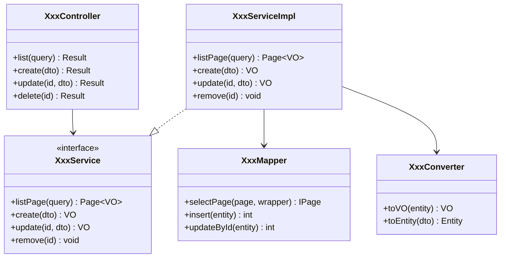
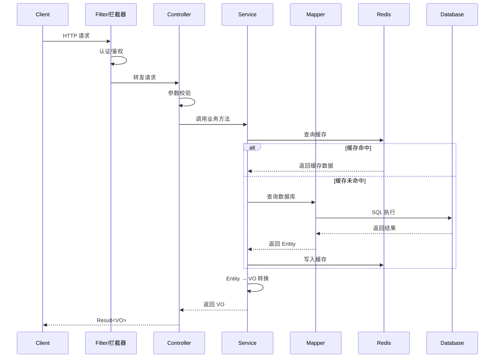
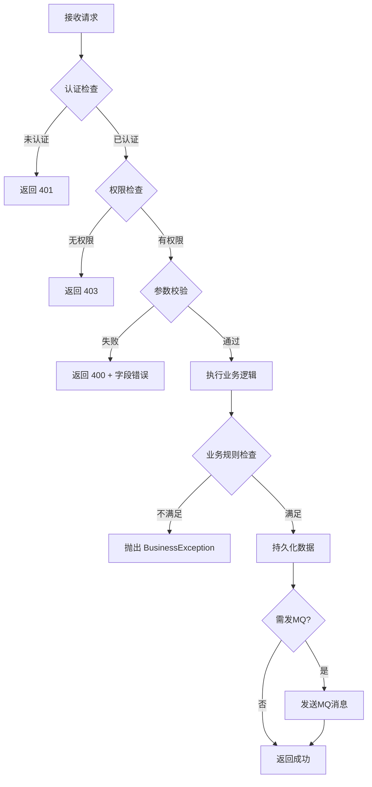
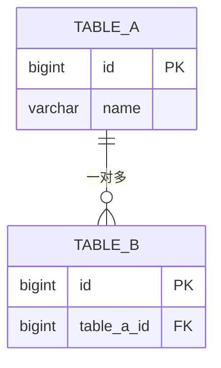

# 后端详细设计与开发规范（AI友好版）

> 基于企业后端设计规范优化，面向AI辅助生成场景。
> 本文档处于软件生命周期的"架构设计→**后端详细设计**→后端代码编写"阶段，承上启下。
> 编码规范通过 references/ 按需加载，避免一次性消耗过多 context。

---

## 全局规则

### 输出格式规范

| 内容类型 | 格式要求 |
|----------|----------|
| 列举型内容（接口清单、字段定义、配置项） | 必须使用**表格** |
| 流程/架构/关系型内容 | 必须使用 **Mermaid 图 + 文字说明** |
| 描述型内容（策略、方案等） | 必须使用**分点列表**，禁止大段纯文字 |
| 代码示例 | 必须使用**代码块**，标注语言类型 |
| DDL/SQL | 必须使用 **SQL 代码块**，附带 COMMENT |

### 信息提取三级策略

| 级别 | 条件 | 处理方式 |
|------|------|----------|
| ① 直接提取 | 架构设计文档或PRD中有明确描述 | 直接引用，来源标注"架构设计文档"或"PRD" |
| ② AI推导 | 上游文档中无直接描述，但可从上下文推导 | AI推导，标注"AI推导"，**用斜体标识** |
| ③ 待补充 | 完全无依据 | 标注"待补充"，在用户交互环节询问 |

### 术语一致性约束

- 所有业务术语必须与架构设计文档术语表一致
- 接口URL、字段名必须与前端详细设计（lyspec-frontend）完全一致
- 数据库表名、字段名使用 snake_case

### 生成模式选择

| 模式 | 说明 | 适用场景 |
|------|------|----------|
| **逐步确认模式**（默认） | 分3个阶段输出，每阶段暂停等待用户确认 | 核心服务、首次使用 |
| **一次性生成模式** | AI一次输出全部内容 | 简单CRUD模块、需求清晰 |

### 文档产物命名规则

- 文档模式：`{模块名称}_后端详细设计_{YYYY-MM-DD}.md`
- 代码模式：直接生成到项目目录
- DDL脚本：`{模块名称}_ddl.sql`

### 复杂度自适应规则

| 模块类型 | 包含章节 | 可精简章节 |
|----------|----------|-----------|
| 全功能服务（接口+MQ+定时任务+缓存） | 全部章节 | 无 |
| 简单CRUD服务 | 一~五、七、九 | 六（高可用）、八（监控） |
| 纯MQ消费服务 | 一、二、三（重点3.5）、四~六、七、九 | 3.3接口清单可精简 |
| 批处理/定时任务 | 一、二、三（重点3.6）、四~六、七、九 | 3.3接口清单可精简 |

> AI应在确认模块类型后自动判断，并告知用户："本模块为{类型}，将精简{章节列表}，是否需要调整？"

---

## 前置条件：上游文档输入

### 上游依赖文档

| 文档 | 必需/可选 | 提取内容 |
|------|-----------|----------|
| 架构设计文档（lyspec-arch产物） | **必需** | 模块划分、技术选型、物理架构、系统流程、非功能需求 |
| PRD（产品需求文档） | **必需** | 功能需求、业务规则 |
| 全栈详细设计文档（lyspec-detail产物） | 可选 | 如已有全栈版，可直接引用并深化 |
| 前端详细设计文档（lyspec-frontend产物） | 可选 | 接口对接清单 → 后端接口须与其一致 |

### AI执行流程

1. **确认上游文档**：
   - "请提供架构设计文档路径（必需）"
   - "请提供PRD文档路径（必需）"
   - "是否有全栈详细设计文档或前端详细设计文档？（可选）"

2. **提取关键信息**：

   **从架构设计文档提取**：
   - 本模块在整体架构中的定位（第12节组件定义表）
   - 本模块的技术选型（第15节物理架构、第19节技术选型清单）
   - 本模块涉及的系统流程（第13节）
   - 非功能性需求（第10节）
   - 与其他模块的依赖关系（第12节依赖关系列）

   **从PRD提取**：
   - 本模块的功能需求清单
   - 业务规则和约束条件
   - 角色权限要求

3. **确认技术栈**：

> 请确认后端技术栈（参考 lytech-stack）：
>
> | 层次 | 需确认项 | 可选范围 |
> |------|---------|---------|
> | 后端语言 | ? | Java 17 (Spring Boot) / Go 1.21.x / Python 3.11.x |
> | 数据库 | ? | KingbaseES V8 / MySQL 8.4 / PostgreSQL / 达梦 / openGauss 5.0 |
> | 缓存 | ? | Redis 7.0.11 / Hazelcast / 无 |
> | 消息队列 | ? | RocketMQ / Kafka / Pulsar / 无 |
> | 搜索引擎 | ? | Elasticsearch / 无 |

4. **加载编码规范**：根据技术栈加载对应 reference 文件
5. **进入设计流程**

### 技术栈与 Reference 对应关系

| 选择 | 加载文件 |
|------|---------|
| 后端 Java | `references/backend-java.md` |
| 数据库 KingbaseES | `references/database-kingbase.md` |
| 任意技术栈 | `references/git-pr.md`（始终加载） |

> **AI生成规则**：
> - 技术栈必须在 `lytech-stack` 范围内
> - 若用户选择清单外技术，须提醒："该技术不在团队规范中，建议提交技术评审后再使用"

### 分步输出策略（逐步确认模式）

| 阶段 | 输出内容 | 暂停点 |
|------|----------|--------|
| 阶段一 | 概览 + 设计考虑 + 接口设计（第一~三章） | ★ **核心交互点**：确认接口设计和错误码 |
| 阶段二 | 内部设计（第四~六章） | 确认分层架构、类图、核心流程 |
| 阶段三 | 数据设计 + 部署运维 + 监控（第七~九章） | 确认表结构、部署和监控方案 |

### 用户交互路线图

```
前置 ──→ [询问] 确认上游文档 + 技术栈 + 模块类型
  │
阶段一 ──→ [暂停] ★ 确认接口设计 + 错误码
  │
阶段二 ──→ [暂停] 确认类图 + 核心流程
  │
阶段三 ──→ [暂停] 确认数据设计 + 部署 + 监控
  │
完成 ──→ 质量检查 ──→ 输出文档 + DDL脚本
```

---

## 任务模式

| 用户意图 | 模式 | 动作 |
|---------|------|------|
| 生成后端详细设计文档 | **文档生成模式** | 按下方文档模板执行 |
| 编写后端代码 | **代码生成模式** | 加载 reference，按规范生成代码 |
| 审查后端代码 | **代码审查模式** | 加载 reference，逐条检查 |
| 设计数据库表 | **数据库设计模式** | 加载 `database-kingbase.md`，输出完整 DDL |
| 不明确 | **询问** | 询问用户具体需求 |

---

## 文档模板

> **生成文档时严格遵循以下模板结构。根据复杂度自适应规则裁剪章节。**

---

### 一、概览

> **输入依赖**：架构设计文档（第12节组件定义表）、PRD
> **输出阶段**：阶段一

- **背景介绍**：{从架构设计文档提取本服务的定位和职责}
- **服务命名**：{从架构设计文档第15节逻辑→物理映射表提取}
- **代码仓库**：{后端仓库地址}
- **关联文档**：
  - 架构设计文档：{文档名称及版本}
  - PRD：{文档名称及版本}
  - 前端详细设计：{文档名称，如有}

#### 修订记录

| 时间 | 版本号 | 修改内容 | 评审状态 | 修改人 |
|------|--------|---------|---------|--------|
| {当前日期} | V 1.0 | 初始版本 | 待评审 | {当前用户} |

> **AI生成规则**：
> - 背景介绍从架构设计文档第12节组件定义表中提取
> - 服务命名必须与架构设计文档物理组件名一致
>
> **常见错误**：
> - ❌ 背景介绍脱离架构设计文档凭空编写 → 必须从上游文档提取

---

### 二、设计考虑

> **输入依赖**：PRD（功能需求）、架构设计文档（第10节非功能需求）
> **输出阶段**：阶段一

#### 2.1 功能特性

| 编号 | 功能点 | 优先级 | PRD来源章节 |
|------|--------|--------|------------|
| F-01 | {功能描述} | 高/中/低 | {PRD对应章节} |

> **AI生成规则**：
> - 功能点从PRD逐条提取，不可遗漏
> - 必须标注PRD来源章节，便于溯源

#### 2.2 非功能特性

| 维度 | 要求描述 | 来源 |
|------|---------|------|
| 安全性 | {认证/授权/数据脱敏要求} | 架构设计文档10.x / *AI推导* |
| 性能 | {响应时间/并发量/TPS 目标} | 架构设计文档10.2 / *AI推导* |
| 数据冗余 | {备份策略/容灾要求} | 架构设计文档 / *AI推导* |
| 可测试性 | {单测覆盖率要求} | 团队规范 |

> **AI生成规则**：
> - 不可使用空泛描述（如"高性能"），必须有具体指标

#### 2.3 兼容性

- 接口兼容性：{新模块标注"首次开发，无兼容性要求"}
- 数据兼容性：{新模块标注"首次开发，无兼容性要求"}

---

### 三、接口设计（对外提供）

> **输入依赖**：架构设计文档（第13节系统流程）、PRD（功能需求）
> **输出阶段**：阶段一

#### 3.1 接口协议

- **通信协议**：{HTTP/HTTPS REST，从架构设计文档提取}
- **数据格式**：JSON
- **认证方式**：{JWT / OAuth2 / 无需认证}
- **API版本策略**：{URL路径版本 /api/v1/}

统一响应体格式：

```json
{
  "code": 0,
  "message": "success",
  "data": {}
}
```

#### 3.2 错误码设计

| 错误码 | HTTP状态码 | 含义 | 说明 |
|--------|-----------|------|------|
| 0 | 200 | 成功 | — |
| 10001 | 400 | 参数校验失败 | message 返回具体字段错误 |
| 10002 | 401 | 未认证 | Token 无效或过期 |
| 10003 | 403 | 无权限 | 无该资源操作权限 |
| 20001 | 500 | 业务异常 | 业务规则不满足 |
| 50001 | 500 | 系统异常 | 未预期的系统错误 |

> **AI生成规则**：
> - 错误码按模块分段：10xxx 通用、20xxx 模块A、30xxx 模块B...
> - 每个模块定义具体业务错误码，不可全部使用通用错误码
> - 须与前端错误处理设计（lyspec-frontend 7.1节）对应
>
> **常见错误**：
> - ❌ 所有错误都返回 code=500 → 应区分客户端错误和服务端错误
> - ❌ message 返回 Java 异常堆栈 → 禁止暴露技术细节

#### 3.3 接口清单

| 接口名称 | Method | URL | 请求体 | 响应体 | 幂等性 | 说明 |
|---------|--------|-----|--------|--------|--------|------|
| 查询列表 | GET | `/api/v1/{resource}` | — | `Result<Page<VO>>` | 天然幂等 | 支持分页搜索 |
| 创建记录 | POST | `/api/v1/{resource}` | `CreateDTO` | `Result<VO>` | 业务键去重 | — |
| 更新记录 | PUT | `/api/v1/{resource}/{id}` | `UpdateDTO` | `Result<VO>` | 天然幂等 | — |
| 删除记录 | DELETE | `/api/v1/{resource}/{id}` | — | `Result<Void>` | 天然幂等 | 软删除 |

> **AI生成规则**：
> - URL 使用小写 kebab-case，名词资源，RESTful 规范
> - 每个非GET接口必须标注幂等性保障方式
> - 此清单必须与前端接口对接清单（lyspec-frontend 4.3节）双向一致
>
> **常见错误**：
> - ❌ URL中使用动词（`/api/v1/createUser`） → 应使用名词资源
> - ❌ 所有操作都用POST → 应按语义使用对应HTTP动词
> - ❌ 漏标幂等性设计 → POST接口必须说明幂等保障方式

#### 3.4 接口详细说明

{每个接口列出请求参数表、响应示例}

**接口：{接口名称}**

请求参数：

| 参数名 | 类型 | 必填 | 校验规则 | 说明 |
|--------|------|------|---------|------|
| {param} | String | 是 | 长度1-64 | {说明} |

响应示例：

```json
{
  "code": 0,
  "message": "success",
  "data": {
    "id": 1,
    "name": "示例"
  }
}
```

> **AI生成规则**：
> - 每个参数必须标注校验规则（长度、范围、格式、枚举值）
> - 响应示例使用真实业务数据格式，不可使用 `"xxx"` 占位
> - 分页接口响应须包含 total、page、size 等分页元信息

#### 3.5 消息队列接口（MQ 输入）

> **跳过条件**：本模块无MQ消费时标注"不适用"

| Topic / Queue | 消费组 | 消息格式 | 处理逻辑 | 幂等保障 | 说明 |
|--------------|--------|---------|---------|---------|------|
| {topic} | {group} | {JSON schema概述} | {处理逻辑} | {去重表/业务键} | — |

> **AI生成规则**：
> - 每个MQ消费必须标注幂等保障方式

#### 3.6 定时任务

> **跳过条件**：本模块无定时任务时标注"不适用"

| 任务名 | 触发方式 | Cron 表达式 | 执行逻辑 | 超时处理 | 并发控制 | 说明 |
|--------|---------|------------|---------|---------|---------|------|
| {taskName} | Cron | `0 0 2 * * ?` | {逻辑描述} | {超时策略} | {单机/分布式锁} | 每天凌晨2点 |

---

### 四、分层架构设计

> **输入依赖**：架构设计文档（第15节、第19节）、第三章接口设计
> **输出阶段**：阶段二

#### 4.1 框架与技术选型

| 层次 | 技术选型 | 版本 | 说明 |
|------|---------|------|------|
| 接入层 | Spring MVC | — | REST 接口 |
| 服务层 | Spring Boot | {版本} | 业务逻辑 |
| 持久层 | MyBatis-Plus | {版本} | ORM |
| 数据库 | {从架构设计提取} | {版本} | 主存储 |
| 缓存 | Redis | 7.0.11 | 热点数据缓存（如需要） |
| 消息队列 | RocketMQ | — | 异步解耦（如需要） |

> **AI生成规则**：
> - 技术选型必须与架构设计文档第19节一致
> - 仅列出本模块实际使用的技术

#### 4.2 分层职责

| 层次 | 包路径 | 职责 | 规范要点 |
|------|--------|------|---------|
| Controller | `controller/` | 参数校验、权限检查、调用Service、组装响应 | 不含业务逻辑，不直接操作DB |
| Service | `service/` | 业务逻辑编排、事务管理 | 接口与实现分离（`XxxService` + `XxxServiceImpl`） |
| Repository/Mapper | `mapper/` | 数据访问、SQL映射 | 复杂SQL写XML，简单查询用注解 |
| DTO/VO/Entity | `dto/` `vo/` `entity/` | 数据传输与展示 | 三者严格分离，不可混用 |

> **AI生成规则**：
> - Controller 不直接调用 Mapper
> - Service 方法名体现业务语义（如 `approveOrder`），不是简单复制 Controller 方法签名
> - DTO/VO/Entity 必须区分：
>   - DTO：接收请求参数（CreateDTO、UpdateDTO、QueryDTO）
>   - VO：返回给前端的视图对象
>   - Entity：数据库映射实体
>
> **常见错误**：
> - ❌ Controller 直接调用 Mapper → 必须经过 Service 层
> - ❌ 所有场景共用一个 DTO → 应区分 CreateDTO、UpdateDTO、QueryDTO
> - ❌ Entity 直接返回给前端 → 应转换为 VO

#### 4.3 DTO/VO/Entity 转换设计

| 转换方向 | 方式 | 工具 | 说明 |
|---------|------|------|------|
| DTO → Entity | 手动映射 / MapStruct | MapStruct（推荐） | 创建/更新时 |
| Entity → VO | 手动映射 / MapStruct | MapStruct（推荐） | 查询返回时 |
| Entity → Entity | 不允许 | — | 禁止跨聚合直接引用 |

```java
// MapStruct 示例
@Mapper(componentModel = "spring")
public interface {Entity}Converter {
    {Entity}VO toVO({Entity} entity);
    {Entity} toEntity({Entity}CreateDTO dto);
    void updateEntity(@MappingTarget {Entity} entity, {Entity}UpdateDTO dto);
}
```

---

### 五、内部设计

> **输入依赖**：第三章接口设计、第四章分层架构
> **输出阶段**：阶段二

#### 5.1 核心类图



> **AI生成规则**：
> - 从第三章接口清单推导 Controller 层方法
> - Service 接口与实现分离
> - 标注依赖关系（实线→依赖，虚线→实现）
>
> **常见错误**：
> - ❌ Service 方法与 Controller 一一对应且签名相同 → Service 应体现业务语义

#### 5.2 异常处理体系

```java
// 异常类层次
BaseException (RuntimeException)
├── BusinessException        // 业务异常（错误码 20xxx）
│   ├── ResourceNotFoundException   // 资源不存在
│   └── DuplicateKeyException       // 重复数据
├── AuthenticationException  // 认证异常（错误码 10002）
└── AuthorizationException   // 授权异常（错误码 10003）
```

| 异常类型 | 错误码范围 | HTTP状态码 | 处理方式 |
|---------|-----------|-----------|---------|
| 参数校验异常 | 10001 | 400 | 全局异常处理器捕获，返回字段级错误 |
| 认证异常 | 10002 | 401 | 过滤器/拦截器处理 |
| 授权异常 | 10003 | 403 | 过滤器/拦截器处理 |
| 业务异常 | 20xxx | 500 | 全局异常处理器捕获，返回业务错误信息 |
| 系统异常 | 50001 | 500 | 全局异常处理器兜底，记录ERROR日志 |

> **AI生成规则**：
> - 异常类须与 3.2 错误码设计一一对应
> - 全局异常处理器统一包装为 Result 格式返回
> - 系统异常 message 不暴露堆栈信息

#### 5.3 事务设计

| 业务场景 | 事务边界 | 传播行为 | 隔离级别 | 说明 |
|---------|---------|---------|---------|------|
| 单表CRUD | Service 方法级 | REQUIRED（默认） | 默认 | — |
| 跨表操作 | Service 方法级 | REQUIRED | 默认 | 保证原子性 |
| MQ消费 | 消费方法级 | REQUIRED | 默认 | 消费失败重试 |
| 查询操作 | 无事务 | — | — | `@Transactional(readOnly = true)` |

> **AI生成规则**：
> - 只读查询使用 `readOnly = true`
> - 涉及多个外部调用的场景，考虑最终一致性（事务消息/补偿机制）
> - 禁止在循环中开启事务
>
> **常见错误**：
> - ❌ 所有 Service 方法都加 `@Transactional` → 查询不需要写事务
> - ❌ 事务方法内调用外部 HTTP → 应将外部调用移出事务

#### 5.4 关键时序图



> **AI生成规则**：
> - 为每个核心业务流程画时序图
> - 涉及缓存读写、MQ发送、外部调用的流程**必须**画时序图
> - 异步调用使用虚线箭头

#### 5.5 核心流程图



> **AI生成规则**：
> - 流程图必须包含认证→鉴权→校验→业务→持久化完整链路
> - 必须包含异常分支

#### 5.6 领域分解（DDD，仅新项目）

> **跳过条件**：存量非DDD项目、简单CRUD模块跳过

```
{业务域}（Domain）
├── 聚合根（Aggregate Root）
├── 实体（Entity）
├── 值对象（Value Object）
├── 仓储接口（Repository）
└── 领域服务（Domain Service）
```

---

### 六、高可用与安全设计

> **输入依赖**：架构设计文档（第16节）
> **输出阶段**：阶段二
> **跳过条件**：简单CRUD模块可精简

#### 6.1 高可用设计

| 措施 | 实现方式 | 适用场景 |
|------|---------|---------|
| 接口幂等 | {唯一业务键/Token机制/乐观锁} | {非GET接口} |
| 限流 | {Sentinel，阈值 QPS≤X} | {高频接口} |
| 熔断降级 | {Sentinel/Resilience4j} | {外部服务调用} |
| 读写分离 | {主写从读} | {读多写少场景} |

> **AI生成规则**：
> - 接口幂等设计须与 3.3 接口清单的幂等性列一致
> - 每个措施标注具体实现方式和适用场景

#### 6.2 安全设计

| 安全维度 | 实现方式 | 说明 |
|---------|---------|------|
| 认证 | {JWT / OAuth2} | Token 有效期、刷新机制 |
| 鉴权 | {RBAC / ABAC} | 角色权限模型 |
| 数据脱敏 | {手机号/身份证/银行卡中间位遮蔽} | 日志 + 接口返回均脱敏 |
| SQL注入防护 | MyBatis 参数化查询 | 禁止拼接SQL |
| XSS防护 | 入参过滤 + 输出转义 | — |
| 敏感数据加密 | AES 对称加密 | 密码、密钥等存储加密 |

> **AI生成规则**：
> - 从架构设计文档第16.3节安全设计提取
> - 脱敏规则须列出具体字段和脱敏方式

---

### 七、外部依赖

> **输入依赖**：架构设计文档（第12节依赖关系列）
> **输出阶段**：阶段二

#### 7.1 依赖的外部服务

| 服务名 | 调用方式 | 接口/方法 | 用途 | 超时时间 | 重试策略 | 降级方案 |
|--------|---------|----------|------|---------|---------|---------|
| {serviceName} | HTTP/RPC | {接口路径} | {用途} | {X}ms | 重试{N}次 | {降级描述} |

> **AI生成规则**：
> - 每个外部依赖必须标注超时、重试、降级
> - 降级方案不可为空
>
> **常见错误**：
> - ❌ 降级方案写"无" → 外部服务不可用时必须有明确行为
> - ❌ 超时30秒 → 应根据场景设置合理超时（通常1~5秒）

#### 7.2 消息队列输出

> **跳过条件**：无MQ生产时标注"不适用"

| Topic | 生产者 | 消息格式 | 触发时机 | 消息可靠性 | 说明 |
|-------|--------|---------|---------|-----------|------|
| {topic} | {service} | {JSON schema概述} | {触发条件} | {事务消息/至少一次} | — |

---

### 八、数据设计

> **输入依赖**：架构设计文档（第3节领域模型）、第三章接口设计
> **输出阶段**：阶段三

数据库规范详见 `references/database-kingbase.md`。

#### 8.1 ER图



> **AI生成规则**：
> - 标注关系类型，多对多须画出中间表

#### 8.2 数据库表设计

数据库：{从技术栈确认结果提取}

**数据量评估**：

| 表名 | 预估初始数据量 | 预估年增长量 | 是否需要分区 |
|------|--------------|-------------|-------------|
| t_{name} | {X}万 | {Y}万/年 | 是/否 |

**表：t_{name}（{表说明}）**

| 字段名 | 类型 | 可空 | 默认值 | 说明 |
|--------|------|------|--------|------|
| id | BIGSERIAL | NOT NULL | 自增 | 主键 |
| {业务字段} | — | — | — | — |
| created_at | TIMESTAMPTZ | NOT NULL | NOW() | 创建时间 |
| updated_at | TIMESTAMPTZ | NOT NULL | NOW() | 更新时间 |
| deleted | BOOLEAN | NOT NULL | FALSE | 软删除标志 |

DDL 语句：

```sql
CREATE TABLE t_{name} (
    id          BIGSERIAL    PRIMARY KEY,
    -- 业务字段
    created_at  TIMESTAMPTZ  NOT NULL DEFAULT NOW(),
    updated_at  TIMESTAMPTZ  NOT NULL DEFAULT NOW(),
    deleted     BOOLEAN      NOT NULL DEFAULT FALSE
);

COMMENT ON TABLE t_{name} IS '{表说明}';
-- 字段注释
-- 索引
```

> **AI生成规则**：
> - 遵循 `references/database-kingbase.md` 建表规范
> - 每张表必须含标准字段（id, created_at, updated_at, deleted）
> - 每张表和每个字段必须添加 COMMENT
> - 外键列必须建索引
> - 软删除场景使用局部索引 `WHERE deleted = FALSE`
>
> **常见错误**：
> - ❌ 字段名驼峰命名 → 必须 snake_case
> - ❌ 使用 TEXT 但有长度限制 → 应用 VARCHAR(n)
> - ❌ 缺少 COMMENT → 每个字段都要注释

#### 8.3 索引设计

| 表名 | 索引名 | 索引列 | 索引类型 | 唯一 | 说明 |
|------|--------|--------|---------|------|------|
| t_{name} | idx_{name}_{col} | {col} | B-tree / 局部索引 | 是/否 | {使用场景} |

> **AI生成规则**：
> - 从第三章接口查询条件推导索引
> - 复合索引遵循最左前缀原则
> - 单表索引不超过5个

#### 8.4 缓存设计

> **跳过条件**：无缓存需求时标注"不适用"

| 缓存 Key 模式 | 数据类型 | TTL | 失效策略 | 一致性保障 | 说明 |
|-------------|---------|-----|---------|-----------|------|
| `{resource}:info:{id}` | String(JSON) | 10min | 主动删除+超时兜底 | 先更新DB再删缓存 | 详情缓存 |

> **AI生成规则**：
> - 标注缓存一致性策略（Cache Aside / Write Through）
> - 标注缓存穿透/击穿/雪崩防护措施（如适用）

#### 8.5 数据迁移方案

> **跳过条件**：新模块标注"首次开发，无历史数据迁移需求"

| 迁移项 | 来源 | 目标 | 迁移方式 | 数据量 |
|--------|------|------|---------|--------|
| {数据项} | {旧表} | {新表} | {全量/增量} | {预估量} |

---

### 九、部署与监控

> **输入依赖**：架构设计文档（第15节、第18节）
> **输出阶段**：阶段三

#### 9.1 部署信息

| 项目 | 说明 |
|------|------|
| 部署环境 | 生产 / 预发 / 测试 |
| 容器规格 | {CPU × 内存 × 副本数} |
| JVM 参数 | {如 `-Xms1g -Xmx2g`} |
| 健康检查 | `/actuator/health`，间隔30s |
| 特殊依赖 | {无 / 列出} |

#### 9.2 上线方案

| 步骤 | 操作 | 验证方式 | 说明 |
|------|------|---------|------|
| 1 | 执行数据库 DDL | 验证表结构正确 | 兼容变更 |
| 2 | 部署后端服务 | 健康检查返回200 | 滚动更新 |
| 3 | 冒烟测试 | 核心接口返回正常 | 自动化测试 |
| 4 | 灰度验证 | 灰度用户功能正常 | 按流量比例 |
| 5 | 全量发布 | 监控指标正常 | — |

**回滚方案**：
- 后端：重新部署上一版本镜像
- 数据库：DDL 仅做增量兼容变更；如需回滚附回滚 DDL

#### 9.3 日志规范

| 日志场景 | 日志级别 | 日志内容 | 说明 |
|---------|---------|---------|------|
| 接口入口 | INFO | traceId, method, url, params | 全局拦截器记录 |
| 业务关键节点 | INFO | traceId, 业务ID, 操作描述 | 如"订单创建成功" |
| 外部调用 | INFO/WARN | traceId, 目标服务, 耗时, 响应码 | 成功INFO，失败WARN |
| 异常捕获 | ERROR | traceId, 异常类型, 消息, 堆栈 | 全局异常处理器 |

> **AI生成规则**：
> - 所有日志必须包含 traceId
> - 禁止记录敏感信息（密码、Token、身份证号、手机号）

#### 9.4 监控告警

| 监控指标 | 告警阈值 | 告警级别 | 处理方式 |
|---------|---------|---------|---------|
| 接口响应时间 P99 | > 2s | WARNING | 检查慢查询、外部调用 |
| 接口错误率 | > 1% | CRITICAL | 检查日志、回滚 |
| JVM 堆内存使用率 | > 85% | WARNING | 检查内存泄漏 |
| 数据库连接池使用率 | > 80% | WARNING | 检查慢SQL、调整连接池 |
| MQ 消费延迟 | > 5min | WARNING | 扩消费者、检查处理逻辑 |

> **AI生成规则**：
> - 监控指标从架构设计文档第10节性能要求推导
> - 每个告警须标注处理方式

---

## 输出产物清单

| 产物 | 格式 | 文件名 | 下游消费方 |
|------|------|--------|-----------|
| 后端详细设计文档 | Markdown | `{模块名}_后端详细设计_{日期}.md` | 代码评审、测试用例生成 |
| DDL脚本 | SQL | `{模块名}_ddl.sql` | DBA执行、数据库版本管理 |
| 初始化数据脚本 | SQL | `{模块名}_init_data.sql`（如有） | 环境初始化 |
| 接口定义 | 可从文档3.3~3.4节提取 | — | 前端对接、API自动化测试 |

### 与上下游 skill 的衔接

| 环节 | 对应 skill | 衔接内容 |
|------|-----------|---------|
| 上游：架构设计 | lyspec-arch | 模块定位→第一章；技术选型→4.1节；非功能需求→2.2节 |
| 上游：全栈详细设计 | lyspec-detail | 如已有全栈版，可引用并深化后端部分 |
| 平行：前端详细设计 | lyspec-frontend | 接口清单须双向一致；错误码须与前端错误处理对应 |
| 下游：测试用例 | lyspec-test-cases | 接口清单→接口测试；错误码→异常场景测试；DDL→数据验证 |
| 下游：代码编写 | — | 类图→代码骨架；接口定义→Controller/Service签名；DDL→Entity |

> **AI生成规则**：
> - 文档完成后主动询问用户是否需要单独导出DDL脚本
> - DDL脚本须完整可执行（含建表、注释、索引）

---

## 附录

### A. 用户交互检查点

- [ ] 上游文档已确认（架构设计文档 + PRD）
- [ ] 技术栈已确认
- [ ] 模块类型已确认
- [ ] 阶段一完成：★ 接口设计 + 错误码已确认
- [ ] 阶段二完成：类图 + 核心流程已确认
- [ ] 阶段三完成：数据设计 + 部署 + 监控已确认

### B. 质量检查点

**上游一致性**：
- [ ] 服务命名与架构设计文档物理组件名一致
- [ ] 技术选型与架构设计文档第19节一致
- [ ] 非功能特性与架构设计文档第10、16节一致

**前后端一致性**：
- [ ] 接口清单（3.3节）与前端接口对接清单双向一致
- [ ] 错误码（3.2节）与前端错误处理设计对应
- [ ] 接口参数字段名与前端 TypeScript 类型一致

**内容完整性**：
- [ ] 功能特性从PRD逐条提取，标注来源
- [ ] 每个接口有完整参数定义和响应示例
- [ ] 每个非GET接口标注幂等性保障
- [ ] 每个外部依赖标注超时、重试、降级
- [ ] 每张表有完整DDL（含COMMENT、索引）
- [ ] 异常类与错误码一一对应
- [ ] 事务设计覆盖所有写操作场景

**下游可消费性**：
- [ ] DDL脚本可直接在数据库执行
- [ ] 类图可直接指导代码骨架生成
- [ ] 接口定义足够详细，前端可直接对接

**格式规范**：
- [ ] 所有图表使用 Mermaid 格式
- [ ] 列举型内容使用表格
- [ ] 信息来源已标注
- [ ] 术语与架构设计文档一致

### C. 参考文档

```
references/
  backend-java.md       Java 后端规范（阿里巴巴开发手册：命名、异常、日志、事务、并发）
  database-kingbase.md  KingbaseES 数据库规范（PGSQL 模式：DDL、索引、SQL、锁）
  git-pr.md             Git 分支、Commit、PR 规范
```
