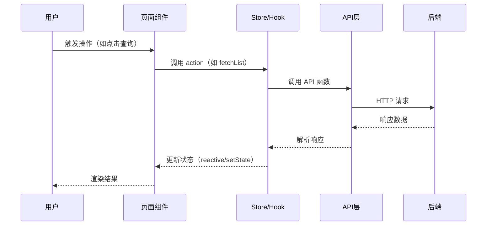
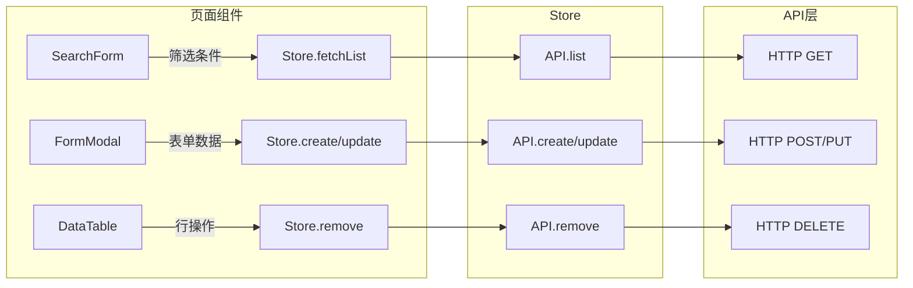

# 前端详细设计与开发规范（AI友好版）

> 基于企业前端设计规范优化，面向AI辅助生成场景。
> 本文档处于软件生命周期的"UI/UE设计→**前端详细设计**→前端代码编写"阶段，承上启下。
> 编码规范通过 references/ 按需加载，避免一次性消耗过多 context。

**设计系统**: 羚羊设计系统（Lingyang Design System）

---

## 全局规则

### 输出格式规范

| 内容类型 | 格式要求 |
|----------|----------|
| 列举型内容（页面清单、组件清单、接口对接清单） | 必须使用**表格** |
| 流程/交互/数据流向 | 必须使用 **Mermaid 图 + 文字说明** |
| 描述型内容（策略、方案等） | 必须使用**分点列表**，禁止大段纯文字 |
| 代码示例 | 必须使用**代码块**，标注语言类型 |

### 信息提取三级策略

| 级别 | 条件 | 处理方式 |
|------|------|----------|
| ① 直接提取 | 上游文档中有明确描述 | 直接引用，来源标注"PRD"/"详细设计"/"UED" |
| ② AI推导 | 上游文档中无直接描述，但可从上下文推导 | AI推导，标注"AI推导"，**用斜体标识** |
| ③ 待补充 | 完全无依据 | 标注"待补充"，在用户交互环节询问 |

### 术语一致性约束

- 页面名称、路由路径必须与PRD和UED产物一致
- 组件名称使用 lingyang 设计系统官方命名
- 接口URL必须与后端详细设计（lyspec-detail/lyspec-backend）完全一致

### 生成模式选择

| 模式 | 说明 | 适用场景 |
|------|------|----------|
| **逐步确认模式**（默认） | 分3个阶段输出，每阶段暂停等待用户确认 | 核心模块、首次使用 |
| **一次性生成模式** | AI一次输出全部内容 | 简单页面、需求清晰 |

### 文档产物命名规则

- 文档模式：`{模块名称}_前端详细设计_{YYYY-MM-DD}.md`
- 代码模式：直接生成到项目目录

### 复杂度自适应规则

| 页面类型 | 包含章节 | 可精简章节 |
|----------|----------|-----------|
| 全功能页面（CRUD + 复杂交互） | 全部章节 | 无 |
| 简单列表页（查询+展示） | 一~四、七 | 五（状态管理可省）、六（性能设计可省） |
| 纯展示页（详情/报表） | 一~三、七 | 四~六 |
| 表单页（新建/编辑） | 一~五、七 | 六（性能设计可省） |

> AI应在确认页面类型后自动判断，并告知用户："本页面为{类型}，将精简{章节列表}，是否需要调整？"

---

## 前置条件：上游文档输入

### 上游依赖文档

| 文档 | 必需/可选 | 提取内容 |
|------|-----------|----------|
| PRD（产品需求文档） | **必需** | 页面清单、功能点、交互规则、角色权限 |
| UI/UE设计产物（lyspec-ued产物） | **推荐** | HTML Demo、页面清单表、组件树、导航结构 |
| 全栈详细设计文档（lyspec-detail产物） | 可选 | 后端接口清单（第四章）→ 前端对接 |
| 后端详细设计文档（lyspec-backend产物） | 可选 | 接口详细定义 → 类型生成、接口对接 |
| 架构设计文档（lyspec-arch产物） | 可选 | 前端技术栈确认、模块划分 |

### AI执行流程

1. **确认上游文档**：询问用户提供的文档类型
   - "请提供PRD文档路径（必需）"
   - "是否有UI/UE设计产物（lyspec-ued HTML Demo）？（推荐）"
   - "是否有后端接口定义（全栈详细设计/后端详细设计/Apifox）？（可选）"

2. **确认技术栈**：

> 请确认前端技术栈：
>
> | 层次 | 需确认项 | 可选范围 |
> |------|---------|---------|
> | 框架 | ? | Vue 3 / React / Tauri / Flutter |
> | 构建工具 | ? | Vite / Webpack / Turbopack |
> | UI组件库 | ? | lingyang / Element Plus / Ant Design Vue / Arco Design |
> | 状态管理 | ? | Pinia / Zustand / Redux |
> | 类型系统 | ? | TypeScript（推荐） / JavaScript |

3. **加载编码规范**：根据技术栈加载对应 reference 文件

4. **获取外部数据**（可选）：
   - UI设计稿 → 调用 MasterGo / Figma MCP 服务
   - API定义 → 调用 Apifox MCP 服务或读取后端详细设计文档

5. **进入设计流程**

### 技术栈与 Reference 对应关系

| 选择 | 加载文件 |
|------|---------|
| 通用（始终加载） | `references/ly-frontend-common.mdc` + `references/git-pr.md` |
| Vue 3 | `references/ly-frontend-vue3.mdc` |
| React | `references/ly-frontend-react.mdc` |
| Tauri | `references/ly-frontend-tauri.mdc` |
| Rust（Tauri后端） | `references/ly-frontend-rust.mdc` |
| Flutter | `references/ly-frontend-flutter.mdc` |

### 分步输出策略（逐步确认模式）

| 阶段 | 输出内容 | 暂停点 |
|------|----------|--------|
| 阶段一 | 概览 + 页面路由 + 目录结构（第一~二章） | 确认项目结构和页面拆分 |
| 阶段二 | 组件设计 + 状态管理 + 接口对接（第三~五章） | ★ **核心交互点**：确认组件树、数据流、接口映射 |
| 阶段三 | 性能设计 + 错误处理 + 部署（第六~八章） | 确认性能策略和部署方案 |

### 用户交互路线图

```
前置 ──→ [询问] 确认上游文档 + 技术栈
  │
阶段一 ──→ [暂停] 确认页面清单 + 目录结构
  │
阶段二 ──→ [暂停] ★ 确认组件树 + 状态管理 + 接口对接
  │
阶段三 ──→ [暂停] 确认性能策略 + 部署方案
  │
完成 ──→ 质量检查 ──→ 输出文档/代码
```

---

## 任务模式

| 用户意图 | 模式 | 动作 |
|---------|------|------|
| 生成前端详细设计文档 | **文档生成模式** | 按下方文档模板执行 |
| 编写前端代码 | **代码生成模式** | 加载 reference，按规范生成代码 |
| 审查前端代码 | **代码审查模式** | 加载 reference，逐条检查 |
| 不明确 | **询问** | 询问用户具体需求 |

---

## 文档模板

> **生成文档时严格遵循以下模板结构。根据复杂度自适应规则裁剪章节。**

---

### 一、概览

> **输入依赖**：PRD、架构设计文档（如有）
> **输出阶段**：阶段一

- **背景介绍**：{本模块前端部分的定位和职责}
- **代码仓库**：{前端仓库地址}
- **关联文档**：
  - PRD：{文档名称及版本}
  - UI/UE设计产物：{HTML Demo 路径，如有}
  - 后端详细设计：{文档名称，如有}

#### 修订记录

| 时间 | 版本号 | 修改内容 | 评审状态 | 修改人 |
|------|--------|---------|---------|--------|
| {当前日期} | V 1.0 | 初始版本 | 待评审 | {当前用户} |

> **AI生成规则**：
> - 背景介绍从PRD或架构设计文档提取本模块前端部分的职责
> - 若有 lyspec-ued 的 HTML Demo，在关联文档中标注路径

---

### 二、页面与路由设计

> **输入依赖**：PRD（页面清单）、lyspec-ued 产物（页面清单表）
> **输出阶段**：阶段一

#### 2.1 页面清单

| 页面名称 | 路由路径 | 所属模块 | 页面类型 | 访问权限 | 是否缓存 | 说明 |
|---------|---------|---------|---------|---------|----------|------|
| {名称} | `/module/page` | {模块} | 列表/表单/详情/看板 | {角色} | 是/否 | — |

> **AI生成规则**：
> - 若有 lyspec-ued 产物，直接引用页面清单表
> - 路由路径遵循 kebab-case，使用名词资源
> - 弹窗/抽屉虽无独立路由，也须在备注中说明
> - 页面缓存策略：列表页通常缓存，表单页通常不缓存
>
> **常见错误**：
> - ❌ 路由路径使用驼峰命名 → 应使用 kebab-case
> - ❌ 权限列写"需要登录" → 应写具体角色名
> - ❌ 遗漏弹窗/抽屉子页面 → 须在备注中说明

#### 2.2 目录结构

```
src/
├── api/                    ← API 请求函数（按模块组织）
│   ├── {module}.ts
│   └── index.ts
├── assets/                 ← 静态资源
├── components/             ← 通用组件
│   └── common/
├── composables/            ← 组合式函数（Vue）/ hooks/（React）
├── router/                 ← 路由配置
│   └── index.ts
├── stores/                 ← 状态管理（Pinia / Zustand）
│   └── {module}.ts
├── types/                  ← TypeScript 类型定义
│   ├── api.ts              ← API 响应/请求类型
│   └── {module}.ts
├── utils/                  ← 工具函数
├── views/                  ← 页面组件（按模块分目录）
│   └── {module}/
│       ├── index.vue/tsx
│       ├── components/     ← 页面私有组件
│       └── hooks/          ← 页面私有 hooks
├── App.vue/tsx
└── main.ts
```

> **AI生成规则**：
> - Vue 项目使用 `composables/`，React 项目使用 `hooks/`
> - 页面私有组件放在 `views/{module}/components/`，非 `components/`
> - 通用组件（被3+页面复用）放在 `components/common/`
> - 按模块组织而非按类型组织

#### 2.3 路由配置

```typescript
// router/index.ts 示例结构
const routes = [
  {
    path: '/{module}',
    name: '{Module}',
    meta: { title: '{模块名称}', roles: ['{角色}'] },
    children: [
      {
        path: 'list',
        name: '{Module}List',
        component: () => import('@/views/{module}/index.vue'),
        meta: { title: '{页面名称}', keepAlive: true }
      }
    ]
  }
];
```

> **AI生成规则**：
> - 路由懒加载使用 `() => import()` 语法
> - `meta.roles` 从 2.1 页面清单的权限列提取
> - `meta.keepAlive` 从 2.1 页面清单的缓存列提取

---

### 三、组件设计

> **输入依赖**：PRD（交互规则）、lyspec-ued 产物（组件树）
> **输出阶段**：阶段二

#### 3.1 组件树

{每个页面输出一棵组件树}

```
PageName（页面类型：查询表格页）
├── SearchForm（筛选区）
│   ├── Input × 2（关键词搜索、编号搜索）
│   ├── Select × 1（状态筛选）
│   ├── Button[primary]（查询）
│   └── Button[default]（重置）
├── ActionBar（操作栏）
│   ├── Button[primary]（新增）→ 打开 FormModal
│   └── Button[danger]（批量删除）→ 确认弹窗
└── DataTable（数据表格）
    ├── columns: 序号/名称/状态(Tag)/创建时间/操作
    ├── 操作列: 编辑(Link)→FormModal / 删除(Link-danger)→确认弹窗
    └── Pagination（分页）
```

> **AI生成规则**：
> - 若有 lyspec-ued 产物，直接引用组件树并细化
> - 标注组件间通信方式（Vue: props/emit/provide-inject; React: props/callback/context）
> - 标注用户操作触发的行为（如"→ 打开 FormModal"）
> - 组件粒度：一个组件只做一件事，超过300行须拆分
>
> **常见错误**：
> - ❌ 组件树只画一层 → 至少展示到第二层
> - ❌ 未标注组件间数据流向 → 必须标注 props 和 emit/callback
> - ❌ 未标注交互行为 → 操作类组件须标注触发目标

#### 3.2 通用组件设计

| 组件名 | 功能 | Props | Events/Callbacks | 复用页面 |
|--------|------|-------|-----------------|---------|
| SearchBar | 通用筛选栏 | `fields, initialValues` | `onSearch, onReset` | 列表页 × N |
| ConfirmModal | 确认弹窗 | `title, content, type` | `onConfirm, onCancel` | 删除操作 × N |

> **AI生成规则**：
> - 被3+页面复用的组件提取为通用组件
> - 每个通用组件标注 Props 类型和事件

#### 3.3 关键交互流程



> **AI生成规则**：
> - 为每个核心页面的主要操作画时序图（如列表查询、表单提交、删除确认）
> - 涉及多步骤的复杂交互（审批流、向导表单）必须画时序图

---

### 四、TypeScript 类型与 API 层设计

> **输入依赖**：后端详细设计（接口清单）/ Apifox API 定义
> **输出阶段**：阶段二

#### 4.1 API 响应类型

```typescript
// types/api.ts — 统一响应体
interface Result<T = unknown> {
  code: number;
  message: string;
  data: T;
}

interface PageResult<T> {
  total: number;
  page: number;
  size: number;
  records: T[];
}
```

#### 4.2 业务类型定义

```typescript
// types/{module}.ts
interface {Entity}VO {
  id: number;
  // 展示字段...
}

interface {Entity}CreateDTO {
  // 创建字段（不含id）...
}

interface {Entity}UpdateDTO {
  id: number;
  // 更新字段...
}

interface {Entity}QueryDTO {
  page: number;
  size: number;
  keyword?: string;
  // 筛选条件...
}
```

> **AI生成规则**：
> - VO（展示）、CreateDTO（创建）、UpdateDTO（更新）、QueryDTO（查询）必须区分
> - 若有后端详细设计文档，类型字段必须与后端接口参数定义完全一致
> - 若无后端定义，从PRD功能需求推导，标注"AI推导"
>
> **常见错误**：
> - ❌ 所有场景共用一个 interface → 应区分 VO / DTO
> - ❌ 类型字段名与后端不一致 → 必须双向校验

#### 4.3 接口对接清单

| 接口名称 | Method | URL | 请求类型 | 响应类型 | 调用页面 | 防重提交 |
|---------|--------|-----|---------|---------|---------|----------|
| 查询列表 | GET | `/api/v1/{resource}` | `{Entity}QueryDTO` | `Result<PageResult<{Entity}VO>>` | ListPage | 否 |
| 创建记录 | POST | `/api/v1/{resource}` | `{Entity}CreateDTO` | `Result<{Entity}VO>` | FormModal | 是 |
| 更新记录 | PUT | `/api/v1/{resource}/{id}` | `{Entity}UpdateDTO` | `Result<{Entity}VO>` | FormModal | 是 |
| 删除记录 | DELETE | `/api/v1/{resource}/{id}` | — | `Result<void>` | ListPage | 是 |

> **AI生成规则**：
> - URL 必须与后端详细设计（lyspec-detail 第4.3节 / lyspec-backend）完全一致
> - POST/PUT/DELETE 操作须标注防重提交
> - 请求和响应使用 4.2 中定义的类型名

#### 4.4 API 层封装

```typescript
// api/{module}.ts
import request from '@/utils/request';
import type { Result, PageResult } from '@/types/api';
import type { {Entity}VO, {Entity}CreateDTO, {Entity}QueryDTO } from '@/types/{module}';

export const {entity}Api = {
  list: (params: {Entity}QueryDTO) =>
    request.get<Result<PageResult<{Entity}VO>>>('/api/v1/{resource}', { params }),

  create: (data: {Entity}CreateDTO) =>
    request.post<Result<{Entity}VO>>('/api/v1/{resource}', data),

  update: (id: number, data: {Entity}UpdateDTO) =>
    request.put<Result<{Entity}VO>>(`/api/v1/{resource}/${id}`, data),

  remove: (id: number) =>
    request.delete<Result<void>>(`/api/v1/{resource}/${id}`),
};
```

> **AI生成规则**：
> - API 函数按模块组织，每个模块一个文件
> - 使用封装后的 request 实例，不直接使用 axios
> - 函数命名使用业务语义（list/create/update/remove），不使用 HTTP 动词

---

### 五、状态管理设计

> **输入依赖**：第三章组件树、第四章接口清单
> **输出阶段**：阶段二
> **跳过条件**：纯展示页、状态仅在组件内部时可跳过

#### 5.1 Store/Hook 清单

| Store / Hook 名称 | 管理数据 | 关键 Action | 持久化 | 说明 |
|-------------------|---------|------------|--------|------|
| `use{Module}Store` | 列表数据、筛选条件、分页信息 | `fetchList`, `create`, `update`, `remove` | 否 | 列表页主 Store |
| `useUserStore` | 用户信息、Token、角色权限 | `login`, `logout`, `refreshToken` | 是（localStorage） | 全局用户状态 |

> **AI生成规则**：
> - Vue 项目使用 Pinia，React 项目使用 Zustand/Context
> - 仅全局共享状态放入 Store，页面局部状态保留在组件内
> - 标注是否需要持久化及存储方式

#### 5.2 数据流设计



---

### 六、前端性能设计

> **输入依赖**：页面清单、数据量评估
> **输出阶段**：阶段三
> **跳过条件**：简单列表页、纯展示页可跳过

#### 6.1 性能优化策略

| 优化项 | 实现方式 | 适用场景 |
|--------|---------|---------|
| 路由懒加载 | `() => import()` | 所有页面（默认） |
| 组件异步加载 | `defineAsyncComponent` / `React.lazy` | 弹窗、大型组件 |
| 列表虚拟滚动 | 虚拟滚动组件 | 数据量 > 500 行 |
| 图片懒加载 | `loading="lazy"` / IntersectionObserver | 图片列表 |
| 请求缓存 | SWR/useSWR/useQuery | 变化频率低的字典数据 |
| 防抖搜索 | `debounce(fn, 300)` | 搜索框实时搜索 |

> **AI生成规则**：
> - 从 2.1 页面清单的数据量评估推导需要的优化策略
> - 路由懒加载和组件异步加载为默认策略，无需用户确认
> - 虚拟滚动仅在数据量预估 > 500 行时启用

#### 6.2 首屏加载优化

| 措施 | 说明 |
|------|------|
| 代码分割 | 按路由分割，vendor 单独打包 |
| Tree Shaking | 确保 UI 组件库按需引入 |
| 资源压缩 | 生产构建启用 gzip/brotli |
| 预加载 | 关键资源使用 `<link rel="preload">` |

---

### 七、前端错误处理设计

> **输入依赖**：后端错误码设计（lyspec-detail 4.2节 / lyspec-backend）
> **输出阶段**：阶段三

#### 7.1 HTTP 错误处理

| 场景 | HTTP状态码 | 处理方式 | 用户提示 |
|------|-----------|---------|---------|
| 未认证 | 401 | 清除 Token，跳转登录页 | "登录已过期，请重新登录" |
| 无权限 | 403 | 停留当前页 | Toast "权限不足" |
| 资源不存在 | 404 | 停留当前页 | Toast "请求的资源不存在" |
| 参数错误 | 400 | 停留当前页 | 显示 message 中的具体错误 |
| 服务异常 | 500/502/503 | 停留当前页 | Toast "服务异常，请稍后重试" |
| 网络断开 | — | 停留当前页 | Toast "网络连接失败，请检查网络" |
| 请求超时 | — | 停留当前页 | Toast "请求超时，请稍后重试" |

> **AI生成规则**：
> - 错误处理须与后端错误码设计对应
> - 用户提示使用中文，禁止暴露技术细节
> - 401 必须触发登录跳转，不可仅 Toast 提示

#### 7.2 表单校验错误

| 场景 | 处理方式 |
|------|---------|
| 必填校验 | 字段级红色提示 + 焦点定位到首个错误字段 |
| 格式校验 | 实时校验（blur 触发），提示具体格式要求 |
| 异步校验（如唯一性） | 输入完成后延迟校验，loading 态反馈 |
| 提交时校验 | 阻止提交 + 滚动到首个错误字段 |

#### 7.3 权限控制设计

| 权限类型 | 实现方式 | 说明 |
|----------|---------|------|
| 路由级权限 | 路由守卫 + `meta.roles` | 无权限路由跳转403页面 |
| 菜单级权限 | 动态菜单渲染 | 根据角色过滤侧边栏菜单 |
| 按钮级权限 | 权限指令（`v-permission` / `usePermission`） | 无权限按钮隐藏或禁用 |
| 数据级权限 | 后端接口控制 | 前端仅展示后端返回的数据 |

> **AI生成规则**：
> - 从PRD的角色权限矩阵推导权限粒度
> - 路由守卫代码须与 2.3 路由配置的 `meta.roles` 对应

---

### 八、构建与部署

> **输入依赖**：架构设计文档（部署架构）
> **输出阶段**：阶段三

#### 8.1 环境配置

| 环境 | 变量文件 | API 地址 | 说明 |
|------|---------|---------|------|
| 开发 | `.env.development` | `http://localhost:{port}` | 本地开发 |
| 测试 | `.env.staging` | `https://test-api.xxx.com` | 测试环境 |
| 生产 | `.env.production` | `https://api.xxx.com` | 生产环境 |

#### 8.2 构建配置

| 配置项 | 说明 |
|--------|------|
| 代码分割 | 按路由分割 + vendor 单独打包 |
| 源码映射 | 生产环境关闭 source map |
| 资源压缩 | 启用 gzip，图片压缩 |
| CDN 配置 | 静态资源上传 CDN，HTML 不缓存 |

#### 8.3 部署方案

| 步骤 | 操作 | 验证方式 |
|------|------|---------|
| 1 | 构建生产包 | 构建成功，无报错 |
| 2 | 上传静态资源至 CDN | 资源可访问 |
| 3 | 更新 HTML 入口 | 页面正常加载 |
| 4 | 验证核心页面 | 关键页面功能正常 |

**回滚方案**：CDN 切换至上一版本静态资源

---

## MCP 集成

本 skill 可通过以下 MCP 服务获取外部数据：

| MCP 服务 | 用途 | 使用场景 |
|---------|------|---------|
| MasterGo MCP | 获取 MasterGo 设计稿信息 | UI/UE 设计还原 |
| Figma MCP | 获取 Figma 设计稿信息 | UI/UE 设计还原 |
| Apifox MCP | 获取 API 接口定义（OpenAPI Spec） | 类型生成、接口对接 |
| Context7 MCP | 查询第三方库文档 | 技术问题查询 |

> MCP 服务不可用时，提示用户检查 MCP 配置，或提供替代输入（截图、文本描述、接口文档）。

---

## 输出产物清单

| 产物 | 格式 | 文件名 | 下游消费方 |
|------|------|--------|-----------|
| 前端详细设计文档 | Markdown | `{模块名}_前端详细设计_{日期}.md` | 代码评审、测试用例生成 |
| 页面路由配置 | TypeScript | 可从文档 2.3 节提取 | 前端开发 |
| TypeScript 类型定义 | TypeScript | 可从文档第四章提取 | 前端开发 |
| API 封装代码 | TypeScript | 可从文档 4.4 节提取 | 前端开发 |

### 与上下游 skill 的衔接

| 环节 | 对应 skill | 衔接内容 |
|------|-----------|---------|
| 上游：UI/UE设计 | lyspec-ued | 页面清单表→2.1节；组件树→3.1节；HTML Demo→视觉参考 |
| 上游：全栈详细设计 | lyspec-detail | 接口清单（4.3节）→4.3节接口对接 |
| 上游：后端详细设计 | lyspec-backend | 接口定义→类型生成、接口对接 |
| 下游：测试用例 | lyspec-test-cases | 页面清单→页面功能测试；交互规则→E2E测试 |
| 下游：代码编写 | — | 文档直接指导前端开发 |

---

## 附录

### A. 用户交互检查点

- [ ] 上游文档已确认（PRD必需）
- [ ] 技术栈已确认
- [ ] 阶段一完成：页面清单 + 目录结构已确认
- [ ] 阶段二完成：★ 组件树 + 接口对接已确认
- [ ] 阶段三完成：性能策略 + 部署方案已确认

### B. 质量检查点

**上游一致性**：
- [ ] 页面名称与PRD一致
- [ ] 若有 lyspec-ued 产物，页面清单和组件树与其一致
- [ ] 接口URL与后端详细设计完全一致
- [ ] 角色权限与PRD角色权限矩阵一致

**内容完整性**：
- [ ] 每个页面有组件树
- [ ] 核心页面有交互时序图
- [ ] VO/DTO 类型定义完整
- [ ] 每个接口有对接说明
- [ ] 通用组件有 Props 和 Events 定义

**代码规范**：
- [ ] 遵循已加载的编码规范（references/*.mdc）
- [ ] TypeScript strict 模式
- [ ] 无 any 类型（必须明确类型定义）
- [ ] 组件命名 PascalCase，文件名与组件名一致

**格式规范**：
- [ ] 所有图表使用 Mermaid 格式
- [ ] 列举型内容使用表格
- [ ] 信息来源已标注

### C. 参考文档

```
references/
  ly-frontend-common.mdc    前端通用规范（HTML/CSS/JS/TS，Vue & React 均适用）
  ly-frontend-vue3.mdc      Vue 3 编码规范（Composition API、Pinia、Composables）
  ly-frontend-react.mdc     React 编码规范（Hooks、状态管理、性能优化）
  ly-frontend-tauri.mdc     Tauri 开发规范
  ly-frontend-rust.mdc      Rust 编码规范（Tauri 后端）
  ly-frontend-flutter.mdc   Flutter 开发规范
  ly-frontend-workflow.md    前端开发流程
  git-pr.md                  Git 分支、Commit、PR 规范
```
