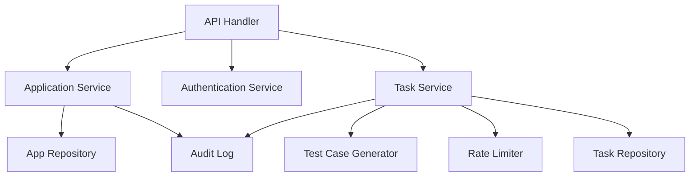

# 测试用例生成开放服务架构设计

## 1. 文档范围

本文档基于现有 PRD 与 UED，对 V1.0 可落地开发范围给出架构约束与模块设计。首版以单体服务形态交付，优先实现对外开放 API、任务编排、结果生成和基础运维能力。

## 2. 架构目标

- 提供可运行、可演示、可测试的开放 API MVP
- 保持模块边界清晰，便于后续替换生成引擎或接入持久化存储
- 通过签名鉴权、限流和审计日志满足最小安全与运维要求

## 3. 技术选型

| 层次 | 选型 | 说明 |
| --- | --- | --- |
| 运行时 | Python 3.10 | 与当前本地执行环境一致，避免额外安装成本 |
| Web 层 | `http.server` | 标准库实现，满足当前 MVP 演示与测试 |
| 并发 | `ThreadPoolExecutor` | 支撑异步生成任务 |
| 数据存储 | 进程内内存存储 | MVP 范围内不引入数据库 |
| 测试 | `unittest` | 无外部依赖，保证仓库即开即测 |

## 4. 逻辑架构

## 5. 模块职责

| 模块 | 职责 |
| --- | --- |
| API Handler | 路由分发、JSON 解析、响应编码、错误映射 |
| Application Service | 创建接入应用、查询应用、重置密钥 |
| Authentication Service | 基于 `app_id + timestamp + nonce + body` 的 HMAC-SHA256 验签 |
| Task Service | 同步/异步任务受理、状态管理、重试控制 |
| Test Case Generator | 将标题、描述、规则、覆盖维度组装成结构化测试用例 |
| Rate Limiter | 单应用分钟级窗口限流 |
| Audit Log | 记录接入、任务创建、成功、失败、重试事件 |

## 6. 关键流程

### 6.1 同步生成

1. 调用方提交带签名的生成请求。
2. API 层完成验签和参数校验。
3. Task Service 创建任务并直接执行生成。
4. 服务返回完整任务信息和结构化测试用例。

### 6.2 异步生成

1. 调用方提交异步生成请求。
2. 服务返回 `task_id` 和当前状态。
3. 后台线程执行生成逻辑。
4. 调用方通过任务查询接口拉取状态和结果。

## 7. 安全设计

- 签名算法：HMAC-SHA256
- 时效控制：请求时间戳允许 5 分钟窗口
- 限流策略：每应用默认 60 次/分钟
- 敏感信息：密钥仅在创建或重置时完整返回

## 8. 非功能要求

- 启动方式简单，无额外基础设施依赖
- 单元测试可在当前仓库直接执行
- 代码结构支持后续替换为数据库或真实生成引擎

## 9. 演进建议

- 将内存仓储升级为 PostgreSQL/MySQL
- 将异步处理升级为消息队列或任务调度器
- 增加回调通知、模板管理和结果文件导出
- 增加租户隔离与更细粒度权限控制
