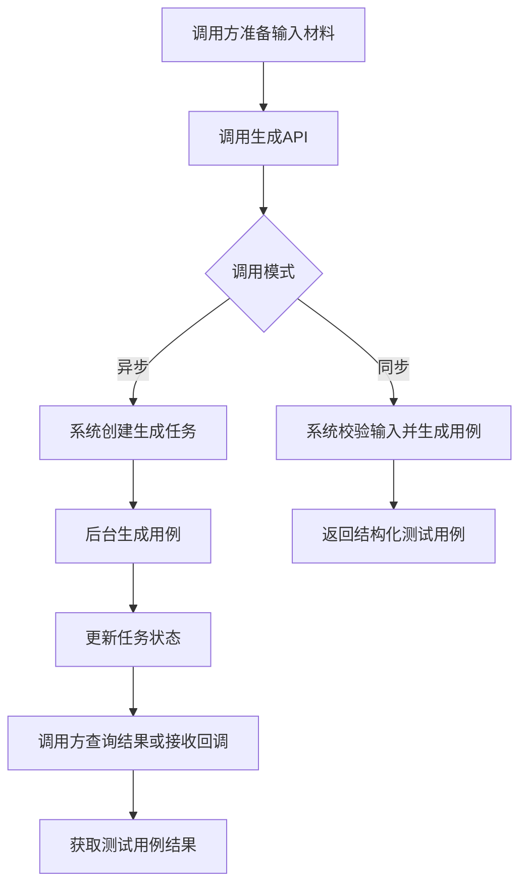
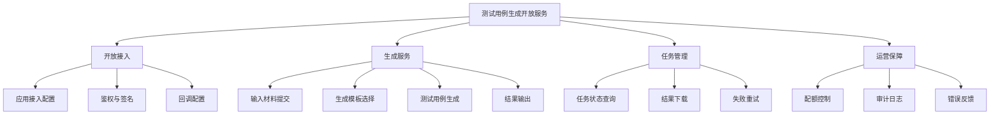
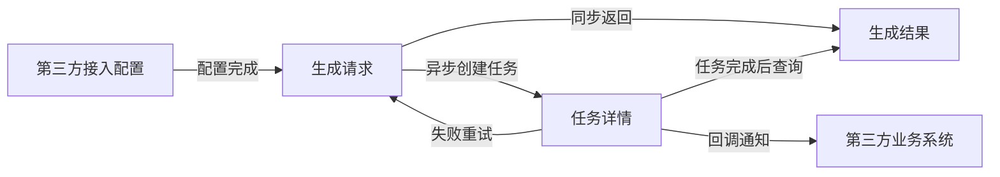
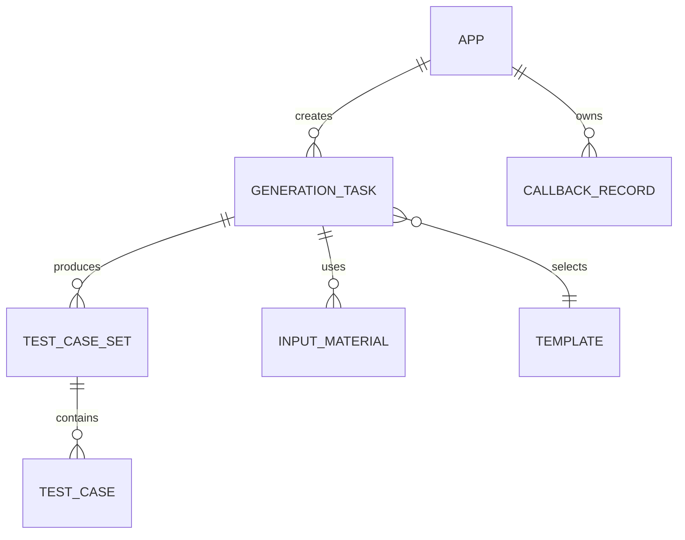
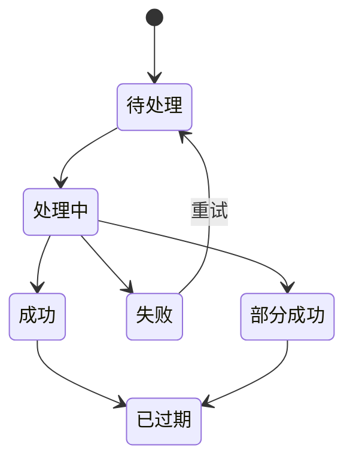

# 测试用例生成开放服务 PRD

## 1. 引言

### 1.1 文档目的

本文档用于定义“测试用例生成开放服务”的产品需求，面向产品、研发、测试、架构与对接实施团队，明确该产品做什么、为什么做、交付什么，以及如何判断需求完成。

### 1.2 项目背景

当前大量企业在需求分析、测试设计和回归测试阶段，仍依赖人工编写测试用例，存在以下问题：

- 编写效率低，需求变更后难以及时补齐测试用例。
- 用例质量受个人经验影响较大，覆盖率与一致性不足。
- 第三方系统虽然有需求、接口定义、原型、用户故事等输入，但缺少可直接嵌入自身流程的用例生成能力。

因此需要建设一个可通过第三方 API 调用的测试用例生成服务，对外提供标准化输入输出能力，使合作方能够在其自有平台、研发流程或测试平台中直接接入自动生成测试用例的能力。

### 1.3 术语定义

| 术语       | 含义                        |
| -------- | ------------------------- |
| 调用方      | 接入本服务的第三方系统或平台            |
| 测试用例生成任务 | 一次基于输入材料发起的测试用例生成请求       |
| 输入材料     | 需求描述、接口说明、原型说明、业务规则、补充约束等 |
| 用例集      | 某次生成任务返回的一组结构化测试用例        |
| 模板       | 指定测试用例输出结构、字段、粒度和风格的配置    |
| 同步生成     | 请求后直接返回生成结果               |
| 异步生成     | 请求后先返回任务 ID，稍后查询结果        |

### 1.4 参考资料

- 来源：用户需求“写一份测试用例生成，能通过第三方 API 调用的 PRD”
- 来源：AI 推导的行业通用测试设计流程与开放平台能力边界

## 2. 项目概述

### 2.1 产品愿景

为第三方业务系统提供“可嵌入、可配置、可追踪”的测试用例自动生成能力，帮助其显著提升测试设计效率与标准化水平。

### 2.2 目标用户

| 角色         | 职责描述               | 典型使用场景              | 权限概述            |
| ---------- | ------------------ | ------------------- | --------------- |
| 第三方系统管理员   | 完成接入配置、密钥管理、调用策略设置 | 新系统接入、查看调用状态、配置回调地址 | 可管理接入配置与查看全量任务  |
| 第三方业务调用方   | 在第三方平台内发起生成请求      | 根据需求文档或接口文档生成测试用例   | 可创建任务、查询自身任务结果  |
| 测试经理/测试负责人 | 审核生成质量，推动落地使用      | 制定模板、确认输出格式、抽检结果    | 可查看结果、下载用例、配置模板 |
| 平台运营/客服    | 支持对接与问题排查          | 协助定位失败任务、解释错误码      | 可查看日志摘要与任务状态    |

### 2.3 系统边界

本系统负责：

- 接收第三方通过 API 提交的测试用例生成请求。
- 对输入材料进行标准化、校验、结构化处理。
- 按预定义模板与规则生成测试用例。
- 提供同步/异步两种调用方式。
- 提供任务状态查询、结果获取、失败原因反馈与回调通知。
- 提供调用鉴权、配额控制、审计记录与基础运营能力。

本系统不负责：

- 替第三方维护完整测试管理流程。
- 直接执行自动化测试。
- 替第三方长期托管原始需求文档的知识库运营。
- 保证生成结果无需人工审核即可直接上线使用。

### 2.4 核心业务流程

## 3. 功能总览

### 3.1 功能结构图

### 3.2 功能清单

| 模块   | 功能     | 子功能       | 优先级 | 版本   | 说明                 |
| ---- | ------ | --------- | --- | ---- | ------------------ |
| 开放接入 | 应用接入配置 | 创建接入应用    | P0  | V1.0 | 为调用方分配应用标识         |
| 开放接入 | 应用接入配置 | 查看接入信息    | P0  | V1.0 | 查看应用状态、回调地址等       |
| 开放接入 | 鉴权与签名  | API 密钥认证  | P0  | V1.0 | 确保请求来源可信           |
| 开放接入 | 鉴权与签名  | 请求签名校验    | P0  | V1.0 | 防止参数篡改与重放          |
| 开放接入 | 回调配置   | 配置结果回调地址  | P1  | V1.0 | 异步任务完成时通知          |
| 生成服务 | 输入材料提交 | 文本描述提交    | P0  | V1.0 | 支持直接传入需求文本         |
| 生成服务 | 输入材料提交 | 结构化字段提交   | P0  | V1.0 | 支持标题、场景、规则等字段      |
| 生成服务 | 输入材料提交 | 附件引用提交    | P1  | V1.0 | 支持传入附件地址或对象引用      |
| 生成服务 | 生成模板选择 | 标准模板选择    | P0  | V1.0 | 默认标准测试用例格式         |
| 生成服务 | 生成模板选择 | 自定义模板选择   | P1  | V1.0 | 按第三方字段结构输出         |
| 生成服务 | 测试用例生成 | 同步生成      | P0  | V1.0 | 适合短文本、快速返回         |
| 生成服务 | 测试用例生成 | 异步生成      | P0  | V1.0 | 适合长文本或批量任务         |
| 生成服务 | 测试用例生成 | 覆盖维度配置    | P0  | V1.0 | 正常、异常、边界等          |
| 生成服务 | 结果输出   | JSON 结果返回 | P0  | V1.0 | 标准 API 输出          |
| 生成服务 | 结果输出   | 文件结果导出    | P1  | V1.0 | Excel/Markdown 等导出 |
| 任务管理 | 任务状态查询 | 按任务 ID 查询 | P0  | V1.0 | 查看生成进度与结果状态        |
| 任务管理 | 结果下载   | 拉取结果详情    | P0  | V1.0 | 获取完整用例集            |
| 任务管理 | 失败重试   | 任务重试发起    | P1  | V1.0 | 对可重试失败任务重发         |
| 运营保障 | 配额控制   | 调用次数限制    | P0  | V1.0 | 限制单应用调用额度          |
| 运营保障 | 审计日志   | 调用记录查询    | P1  | V1.0 | 支持问题排查             |
| 运营保障 | 错误反馈   | 错误码与失败原因  | P0  | V1.0 | 对接方可快速定位问题         |

### 3.3 版本规划

| 版本   | 范围                                     |
| ---- | -------------------------------------- |
| MVP  | API 接入、同步/异步生成、任务查询、JSON 结果返回、基础鉴权与错误码 |
| V1.0 | 在 MVP 基础上增加模板配置、回调通知、配额管理、结果下载         |
| V2.0 | 增加领域知识增强、历史任务复用、批量项目生成、质量评分与反馈学习       |

### 3.4 页面/接口导航关系图

## 4. 用例描述

### UC-01：创建接入应用

**参与角色**：第三方系统管理员  
**前置条件**：管理员已具备平台管理权限  
**后置条件**：系统为该调用方生成可用的接入应用信息

**主流程（正常路径）**

1. 管理员进入接入管理页面。
2. 系统展示已有接入应用列表。
3. 管理员点击“新建接入应用”。
4. 系统弹出创建表单。
5. 管理员填写应用名称、用途说明、回调地址等信息并提交。
6. 系统校验信息合法性并创建应用。
7. 系统展示新应用的接入标识与密钥信息。

**异常流程**

- E1：应用名称重复 -> 系统提示“应用名称已存在，请修改后重试”
- E2：回调地址格式不合法 -> 系统提示“回调地址格式错误”

**业务规则**

- BR1：每个应用名称在同一租户内必须唯一。
- BR2：密钥只在首次生成时完整展示一次。
- BR3：回调地址必须符合平台允许的协议与域名规则。

**关键交互动作**

| 动作触发       | 交互形态     | 包含信息/字段                            | 校验/约束           | 结果反馈         |
| ---------- | -------- | ---------------------------------- | --------------- | ------------ |
| 点击“新建接入应用” | Modal 弹窗 | 应用名称(必填)、用途说明(选填)、回调地址(选填)、联系人(选填) | 应用名称唯一；回调地址格式合法 | 创建成功后刷新列表并提示 |
| 点击“查看详情”   | 页面跳转     | 展示应用标识、状态、创建时间、回调配置                | 仅管理员可查看         | 进入应用详情页      |
| 点击“重置密钥”   | 确认弹窗     | 二次确认提示信息                           | 需输入确认信息；旧密钥失效   | 重置成功并提示重新保存  |

**UI 要求**

- 接入信息需分为“基础信息”“鉴权信息”“回调设置”三个区域展示。
- 敏感字段默认脱敏展示，避免误泄露。

### UC-02：发起测试用例生成任务

**参与角色**：第三方业务调用方  
**前置条件**：调用方已获得有效应用凭证  
**后置条件**：系统完成用例生成或创建生成任务

**主流程（正常路径）**

1. 调用方向生成 API 提交请求。
2. 系统完成鉴权、签名校验和参数校验。
3. 系统解析输入材料并识别生成配置。
4. 若为同步模式，系统直接生成测试用例并返回结果。
5. 若为异步模式，系统创建任务并返回任务 ID。

**异常流程**

- E1：鉴权失败 -> 系统返回鉴权失败错误码与原因
- E2：输入材料为空或信息不足 -> 系统返回参数校验失败
- E3：超过调用频率限制 -> 系统返回限流错误码

**业务规则**

- BR1：每次请求必须包含唯一请求流水号，便于幂等处理。
- BR2：同步模式仅适用于输入材料规模在平台允许范围内的请求。
- BR3：调用方可指定覆盖维度，如正常、异常、边界、权限、兼容。
- BR4：若调用方未指定模板，则默认使用标准模板输出。

**关键交互动作**

| 动作触发         | 交互形态      | 包含信息/字段                                                    | 校验/约束           | 结果反馈             |
| ------------ | --------- | ---------------------------------------------------------- | --------------- | ---------------- |
| 调用“生成测试用例”接口 | 页面跳转      | 应用标识、签名、请求流水号、业务标题(必填)、输入材料(必填)、生成模式(必填)、模板标识(选填)、覆盖维度(选填) | 鉴权通过；必填项完整；请求幂等 | 同步返回结果或异步返回任务 ID |
| 提交结构化业务规则    | Drawer 抽屉 | 场景描述(必填)、前置条件(选填)、业务规则列表(选填)、期望覆盖重点(选填)                    | 内容长度与格式符合约束     | 系统纳入生成上下文        |
| 提交附件引用       | Modal 弹窗  | 附件名称(必填)、附件地址/对象ID(必填)、附件类型(必填)                            | 引用可访问；类型在允许范围内  | 引用成功并记录到任务上下文    |

**UI 要求**

- 对接文档需提供完整字段说明、示例请求与错误码说明。
- 调用测试页面需支持快速粘贴样例材料并预览返回结构。

### UC-03：查询生成任务状态

**参与角色**：第三方业务调用方  
**前置条件**：已创建异步生成任务  
**后置条件**：调用方获知任务当前状态

**主流程（正常路径）**

1. 调用方通过任务查询 API 传入任务 ID。
2. 系统校验调用权限。
3. 系统返回任务状态、创建时间、更新时间及摘要信息。
4. 若任务已完成，系统同时返回结果获取方式。

**异常流程**

- E1：任务 ID 不存在 -> 系统返回“任务不存在”
- E2：任务归属不匹配 -> 系统返回“无权访问该任务”

**业务规则**

- BR1：任务状态至少包括“待处理、处理中、成功、失败、部分成功、已过期”。
- BR2：失败任务需返回机器可解析的错误码与人工可读的失败原因。

**关键交互动作**

| 动作触发         | 交互形态     | 包含信息/字段           | 校验/约束    | 结果反馈      |
| ------------ | -------- | ----------------- | -------- | --------- |
| 调用“查询任务状态”接口 | 页面跳转     | 应用标识、签名、任务 ID(必填) | 任务归属校验   | 返回当前任务状态  |
| 点击“查看任务详情”   | 页面跳转     | 状态、创建时间、输入摘要、失败原因 | 仅任务归属方可见 | 展示任务详情    |
| 点击“刷新状态”     | Toast 提示 | 无新增字段             | 刷新频率受限   | 成功后更新展示结果 |

**状态/操作矩阵**

| 当前状态 | 可执行操作         | 操作角色 | 目标状态 |
| ---- | ------------- | ---- | ---- |
| 待处理  | 查询状态          | 调用方  | 待处理  |
| 处理中  | 查询状态          | 调用方  | 处理中  |
| 成功   | 查看结果 / 下载结果   | 调用方  | 成功   |
| 失败   | 查看失败原因 / 发起重试 | 调用方  | 待处理  |
| 部分成功 | 查看结果 / 查看失败项  | 调用方  | 部分成功 |
| 已过期  | 重新发起任务        | 调用方  | 待处理  |

**UI 要求**

- 状态展示需同时支持文字状态与颜色标签。
- 失败原因需支持展开查看完整说明。

### UC-04：获取测试用例生成结果

**参与角色**：第三方业务调用方、测试经理  
**前置条件**：任务状态为成功或部分成功  
**后置条件**：调用方获得结构化测试用例结果

**主流程（正常路径）**

1. 调用方通过结果接口获取生成结果。
2. 系统返回测试用例列表、摘要统计及输出元信息。
3. 调用方在自身系统中展示、保存或继续处理结果。

**异常流程**

- E1：任务未完成 -> 系统提示“任务尚未完成，暂不可获取结果”
- E2：结果已过期 -> 系统提示“结果已过期，请重新生成”

**业务规则**

- BR1：每条测试用例至少包含标题、前置条件、步骤、预期结果、优先级。
- BR2：结果中需包含生成时间、模板信息和覆盖维度说明。
- BR3：若存在未生成成功的项，需清晰标识成功与失败部分。

**关键交互动作**

| 动作触发       | 交互形态 | 包含信息/字段                   | 校验/约束      | 结果反馈      |
| ---------- | ---- | ------------------------- | ---------- | --------- |
| 调用“获取结果”接口 | 页面跳转 | 任务 ID(必填)、返回格式(选填)        | 任务必须完成且未过期 | 返回结构化用例结果 |
| 点击“查看用例详情” | 页面跳转 | 用例标题、适用场景、步骤、预期、标签        | 仅已生成结果可查看  | 展示单条用例详情  |
| 点击“下载结果文件” | 确认弹窗 | 下载格式(Excel/Markdown/JSON) | 下载格式在开放范围内 | 触发下载并提示成功 |

**UI 要求**

- 结果列表需支持按优先级、场景标签、覆盖类型筛选。
- 单条用例详情需便于复制和二次编辑。

### UC-05：异步回调通知结果

**参与角色**：第三方系统管理员、第三方业务系统  
**前置条件**：调用方已配置可用回调地址并发起异步任务  
**后置条件**：第三方系统收到任务完成通知

**主流程（正常路径）**

1. 异步任务完成后，系统读取调用方回调配置。
2. 系统向回调地址推送任务状态与结果摘要。
3. 第三方系统返回成功响应。
4. 系统记录回调成功状态。

**异常流程**

- E1：回调超时 -> 系统按重试策略再次投递
- E2：回调响应异常 -> 系统记录失败并进入重试

**业务规则**

- BR1：回调消息必须带签名，便于第三方验签。
- BR2：回调仅传递结果摘要与结果获取标识，不强制传输完整大结果。
- BR3：超过最大重试次数后，任务标记为“回调失败但结果可查”。

**关键交互动作**

| 动作触发     | 交互形态      | 包含信息/字段                             | 校验/约束        | 结果反馈       |
| -------- | --------- | ----------------------------------- | ------------ | ---------- |
| 配置回调地址   | Drawer 抽屉 | 回调地址(必填)、签名方式(必填)、通知事件(必填)、超时阈值(选填) | 地址合法；事件类型受支持 | 配置保存成功     |
| 任务完成触发回调 | 页面跳转      | 任务 ID、任务状态、结果摘要、验签字段                | 回调签名有效；目标可达  | 第三方确认后记为成功 |
| 查看回调记录   | 页面跳转      | 回调时间、响应码、重试次数、最终结果                  | 仅管理员可见       | 展示回调历史     |

**状态/操作矩阵**

| 当前状态 | 可执行操作       | 操作角色     | 目标状态        |
| ---- | ----------- | -------- | ----------- |
| 待回调  | 自动回调        | 系统       | 回调成功 / 回调失败 |
| 回调失败 | 自动重试 / 人工查看 | 系统 / 管理员 | 回调成功 / 回调失败 |
| 回调成功 | 查看记录        | 管理员      | 回调成功        |

**UI 要求**

- 回调日志需突出展示最近一次响应结果与累计重试次数。
- 支持管理员查看签名校验字段说明。

## 5. 数据需求

### 5.1 核心业务实体

| 实体              | 核心属性                                | 说明         |
| --------------- | ----------------------------------- | ---------- |
| APP             | 应用标识、应用名称、状态、密钥信息、回调配置              | 表示第三方接入主体  |
| GENERATION_TASK | 任务 ID、任务状态、生成模式、输入摘要、创建时间、完成时间、失败原因 | 表示一次用例生成请求 |
| INPUT_MATERIAL  | 材料类型、材料内容、材料引用地址、解析状态               | 表示任务的输入内容  |
| TEMPLATE        | 模板标识、模板名称、输出字段定义、适用场景               | 表示输出结构模板   |
| TEST_CASE_SET   | 结果 ID、结果摘要、覆盖维度、统计信息、过期时间           | 表示某次生成结果集合 |
| TEST_CASE       | 用例标题、前置条件、步骤、预期结果、优先级、标签            | 表示单条测试用例   |
| CALLBACK_RECORD | 回调时间、回调结果、重试次数、响应摘要                 | 表示回调通知记录   |

### 5.2 数据字典

#### 任务状态

| 项目   | 枚举值                 | 说明       |
| ---- | ------------------- | -------- |
| 生成模式 | 同步、异步               | 任务处理方式   |
| 覆盖维度 | 正常、异常、边界、权限、兼容、流程   | 测试设计关注点  |
| 结果格式 | JSON、Markdown、Excel | 结果输出格式   |
| 应用状态 | 启用、禁用、冻结            | 接入应用当前状态 |

### 5.3 数据生命周期

| 数据对象 | 创建时机       | 更新时机       | 归档/删除规则      |
| ---- | ---------- | ---------- | ------------ |
| 接入应用 | 管理员创建应用时   | 修改配置、重置密钥时 | 禁用后保留审计记录    |
| 生成任务 | 调用方发起请求时   | 状态流转、回调更新时 | 超过保留期限后过期    |
| 生成结果 | 任务成功或部分成功时 | 补充下载记录时    | 超过结果有效期后标记过期 |
| 回调记录 | 每次异步通知时    | 重试后更新结果    | 按审计策略保留      |

## 6. 接口需求（系统集成）

### 6.1 外部系统集成清单

| 序号  | 外部系统         | 集成目的       | 数据流向        | 触发方式    | 备注     |
| --- | ------------ | ---------- | ----------- | ------- | ------ |
| 1   | 第三方业务系统      | 发起测试用例生成请求 | 双向          | 实时调用    | 核心集成对象 |
| 2   | 第三方测试管理平台    | 接收生成结果并落库  | 双向          | 实时调用/回调 | 可选接入形态 |
| 3   | 第三方对象存储或附件系统 | 提供输入材料引用   | 单向（第三方到本系统） | 任务生成时读取 | P1 能力  |

### 6.2 集成交互描述

| 集成点  | 数据流向         | 触发条件      | 业务语义            |
| ---- | ------------ | --------- | --------------- |
| 生成请求 | 第三方系统 -> 本系统 | 调用方提交生成请求 | 提交需求材料并请求生成测试用例 |
| 任务查询 | 第三方系统 -> 本系统 | 查询异步任务状态  | 获取任务当前进度和处理结果   |
| 结果获取 | 第三方系统 -> 本系统 | 任务完成后拉取结果 | 获取完整测试用例集       |
| 结果回调 | 本系统 -> 第三方系统 | 异步任务完成后   | 通知任务完成并提供结果摘要   |

### 6.3 集成约束

| 维度   | 约束描述                  |
| ---- | --------------------- |
| 认证要求 | 所有开放调用必须携带应用身份标识与签名信息 |
| 幂等要求 | 相同请求流水号的重复请求必须具备幂等语义  |
| 频率限制 | 单应用调用频率、并发任务数与日调用量需受控 |
| 回调要求 | 回调地址需稳定可访问，并支持验签      |
| 数据格式 | 输入与输出采用统一结构化字段定义      |
| 结果时效 | 异步结果需在约定有效期内可查询和下载    |

## 7. 非功能需求

### 7.1 性能需求

以下指标因用户未提供明确数字，先标记为待确认：

| 指标         | 要求  |
| ---------- | --- |
| 同步请求最大响应时间 | 待确认 |
| 异步任务平均完成时间 | 待确认 |
| 单应用最大并发任务数 | 待确认 |
| 单日最大调用量    | 待确认 |
| 单次输入材料上限   | 待确认 |

### 7.2 安全需求

- 所有 API 调用必须完成身份认证与请求签名校验。
- 敏感信息如密钥、签名字段、回调凭证必须脱敏展示。
- 输入材料与生成结果在传输过程中必须加密保护。
- 系统需记录关键审计操作，包括应用创建、密钥重置、任务调用、结果下载。
- 不同调用方的数据需相互隔离，禁止跨应用查询任务与结果。

### 7.3 可用性需求

| 项目     | 要求               |
| ------ | ---------------- |
| 服务可用性  | 待确认              |
| 回调失败补偿 | 支持自动重试与人工排查      |
| 结果可追踪性 | 所有任务必须可查询状态与失败原因 |

### 7.4 兼容性需求

- 兼容主流服务端调用方式，支持标准 HTTP API 调用。
- 支持 JSON 作为标准请求与响应格式。
- 对外文档需兼容第三方后端、测试平台和流程平台接入。

### 7.5 可维护性需求

- 错误码体系需稳定、可扩展、可文档化。
- 平台需支持按应用、按任务快速定位调用问题。
- 关键任务状态变化需具备可观测性。
- 模板与输出字段应支持后续平滑扩展。

## 8. 约束与假设

### 8.1 技术约束

- 对外必须提供标准化 API 形式的能力，不以人工页面操作作为唯一入口。
- 输出结果需适配第三方系统可编程消费，而非仅适合人工阅读。
- 详细 API 字段设计、协议细节和内部实现方式不在本 PRD 范围内。

### 8.2 业务约束

- 生成结果为“辅助生成”，默认仍需业务方或测试方复核。
- 不同行业、不同项目的测试标准存在差异，V1.0 需以通用模板为主。
- 第三方上传或引用的输入材料合法性由调用方负责。

### 8.3 假设条件

- 假设第三方已具备可调用开放 API 的技术能力。
- 假设第三方可提供足够清晰的需求文本、业务规则或接口说明。
- 假设调用方愿意接受“同步适合轻量任务、异步适合复杂任务”的产品模式。
- 假设调用方对测试用例字段结构存在差异化需求，因此模板能力需要预留扩展空间。

### 8.4 风险识别

| 风险       | 描述                    | 应对策略               |
| -------- | --------------------- | ------------------ |
| 输入质量不足   | 调用方提交材料过于简略，导致生成结果不稳定 | 强化输入校验，给出补充建议与失败原因 |
| 行业差异大    | 通用模板难以满足所有行业场景        | 提供模板化与可配置能力        |
| 第三方回调不稳定 | 异步结果通知可能频繁失败          | 支持重试、查询兜底与回调日志     |
| 需求持续扩展   | 后续可能增加更多输出字段和格式       | 保持输出结构可扩展          |
| 结果被误用    | 调用方将生成结果直接用于上线而不复核    | 在文档和结果中明确“需人工审核”提示 |

## 9. 验收标准

### 9.1 功能验收标准

| 模块   | 功能     | 验收条件                    | 优先级 |
| ---- | ------ | ----------------------- | --- |
| 开放接入 | 创建接入应用 | 管理员可成功创建应用并获取可用接入凭证     | P0  |
| 开放接入 | API 鉴权 | 非法请求被正确拦截，合法请求可正常通过     | P0  |
| 生成服务 | 同步生成   | 轻量输入场景下可直接返回结构化测试用例结果   | P0  |
| 生成服务 | 异步生成   | 复杂输入场景下可返回任务 ID 并完成后台生成 | P0  |
| 生成服务 | 模板选择   | 调用方可指定模板并按模板字段返回结果      | P1  |
| 任务管理 | 状态查询   | 调用方可按任务 ID 查询正确状态       | P0  |
| 任务管理 | 结果获取   | 任务完成后可获取完整结果且结构正确       | P0  |
| 任务管理 | 失败反馈   | 失败任务可返回明确错误码与失败原因       | P0  |
| 开放接入 | 回调通知   | 异步任务完成后可向配置地址发送通知       | P1  |
| 运营保障 | 配额控制   | 超出限制的请求被正确限流并提示原因       | P0  |

### 9.2 非功能验收标准

| 类别   | 验收项     | 标准                   |
| ---- | ------- | -------------------- |
| 安全   | 鉴权与签名   | 所有请求必须通过身份认证与签名验证    |
| 安全   | 数据隔离    | 不允许跨应用访问任务与结果        |
| 可维护性 | 错误定位    | 失败请求可通过任务记录定位原因      |
| 可用性  | 异步兜底    | 回调失败时调用方仍可通过查询接口获取结果 |
| 性能   | 响应与吞吐指标 | 待确认后补充量化标准           |

### 9.3 交付物清单

- 产品需求规格说明书（本文件）
- 对外接口能力清单
- 错误码与状态码说明文档
- 第三方接入说明文档
- 测试用例输出字段说明
- 验收测试用例

## 附录：建议的标准输出用例字段

为便于第三方快速集成，建议 V1.0 标准模板至少包含以下字段：

| 字段             | 说明             |
| -------------- | -------------- |
| caseId         | 用例唯一标识         |
| title          | 用例标题           |
| module         | 所属模块           |
| scenario       | 场景描述           |
| preconditions  | 前置条件           |
| steps          | 测试步骤           |
| expectedResult | 预期结果           |
| priority       | 优先级            |
| caseType       | 用例类型，如正常/异常/边界 |
| tags           | 标签             |
| sourceSummary  | 输入材料摘要         |

## 后续衔接建议

- 下一步可继续输出“第三方 API 测试用例生成服务”的详细设计文档。
- 若需要，我也可以继续补一版可直接用于评审的接口清单、时序图和错误码草案。
