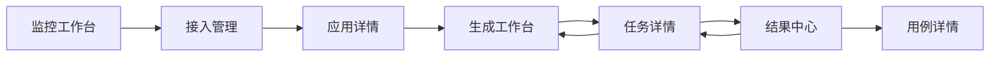

# 测试用例生成开放服务 UI/UE 设计说明

## 1. 页面清单

| 页面名称 | 路由/文件 | 所属模块 | 页面模板类型 | 核心功能 | 覆盖层 | 角色 |
|---|---|---|---|---|---|---|
| 监控工作台 | `pages/monitor-dashboard.html` | 总览 | 分析页 | 监控调用量、任务状态、模板热度、待办事项 | Toast | 管理员、运营 |
| 接入管理 | `pages/app-access.html` | 开放接入 | 查询表格页 | 新建应用、查看详情、重置密钥 | 新建应用 Modal、重置密钥确认弹窗 | 系统管理员 |
| 应用详情 | `pages/app-detail.html` | 开放接入 | 基础详情页 | 展示基础信息、鉴权信息、回调设置 | Toast | 系统管理员 |
| 生成工作台 | `pages/generate-request.html` | 生成服务 | 基础表单页 | 提交输入材料、选择模板、设置覆盖维度 | 结构化业务规则 Drawer、附件引用 Modal | 业务调用方 |
| 任务详情 | `pages/task-detail.html` | 任务管理 | 基础详情页 | 查看状态、输入摘要、回调状态与时间线 | 重试确认弹窗 | 业务调用方 |
| 结果中心 | `pages/result-center.html` | 结果输出 | 查询表格页 | 筛选结果、查看详情、下载文件 | 下载确认弹窗 | 业务调用方、测试经理 |
| 用例详情 | `pages/case-detail.html` | 结果输出 | 基础详情页 | 查看单条用例详情、复制和标记重点 | Toast | 业务调用方、测试经理 |

## 2. 导航结构

```text
CaseFlow API
├── 监控工作台
├── 开放接入
│   ├── 接入管理
│   └── 应用详情
└── 生成服务
    ├── 生成工作台
    ├── 任务详情
    ├── 结果中心
    └── 用例详情
```

## 3. 页面导航关系



## 4. 组件树

```text
监控工作台
├── Sidebar
├── Topbar
├── HeroBanner
├── StatBar
├── ChartCard(近7日趋势 / ECharts)
├── ChartCard(状态分布 / ECharts)
├── RankList(热门模板)
└── TodoTable

接入管理
├── Sidebar
├── Topbar
├── PageHeader
├── Toolbar(FilterForm + ActionButtons)
├── Table(AppList)
├── Modal.新建接入应用
└── Confirm.重置密钥

生成工作台
├── Sidebar
├── Topbar
├── PageHeader
├── FormCard(RequestFields)
├── MultiSelect(覆盖维度)
├── PreviewCard(JSONSummary)
├── Drawer.结构化业务规则
└── Modal.附件引用
```

## 5. 交互规格汇总

| 触发动作 | 页面 | 交互形态 | 说明 |
|---|---|---|---|
| 点击“新建接入应用” | 接入管理 | Modal | 填写应用名称、用途说明、回调地址、联系人 |
| 点击“重置密钥” | 接入管理 | 确认弹窗 | 需要输入 `RESET` 二次确认 |
| 点击“补充业务规则” | 生成工作台 | Drawer | 录入场景描述、前置条件、业务规则和覆盖重点 |
| 点击“添加附件引用” | 生成工作台 | Modal | 提交附件名称、附件类型、附件地址 |
| 点击“生成测试用例” | 生成工作台 | Toast + 跳转 | 生成成功后跳转任务详情 |
| 点击“刷新状态” | 任务详情 | Toast | 展示刷新反馈 |
| 点击“下载结果文件” | 结果中心 | 确认弹窗 | 选择下载格式后确认 |
| 点击“复制用例” | 用例详情 | Toast | 便于二次编辑和复用 |

## 6. 状态 / 操作规则

| 状态 | 视觉表现 | 页面操作 |
|---|---|---|
| 待处理 | `tag-info` | 可刷新状态 |
| 处理中 | `tag-info` | 可刷新状态 |
| 成功 | `tag-success` | 可查看结果、下载文件 |
| 失败 | `tag-danger` | 可查看失败原因、发起重试 |
| 部分成功 | `tag-warning` | 可查看结果与失败项 |
| 已过期 | 默认灰色文案 | 提示重新发起任务 |

## 7. 设计规范摘要

- 色彩、字号、圆角、阴影全部遵循 `lyspec-ued` 的 design tokens。
- 整体视觉走“开放平台控制台”风格，强调可信、清晰、可追踪。
- 监控工作台使用 ECharts 渲染真实图表，不使用空白占位框。
- 各标准页面均包含 Sidebar、Topbar、Breadcrumb 和统一按钮体系。
- 页面针对移动端做了单列降级，桌面默认按照 1440px 设计。

## 8. 文件清单

```text
docs/test_case_generation_api_v1.0_UED/
├── index.html
├── assets/styles.css
├── pages/*.html
└── README.md
```
